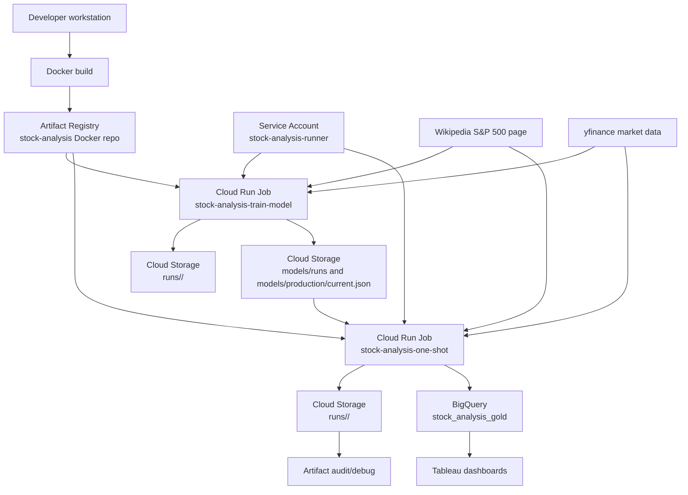
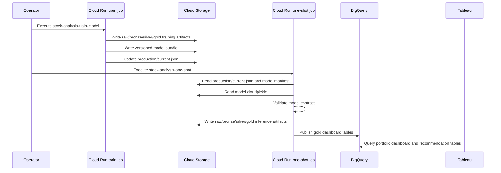

# Cloud Architecture

This document explains the current GCP architecture used by the stock-analysis cloud pipeline, the
resources involved, and the responsibility of each resource. The cloud path is additive: it does not
replace the local pipeline. It provides an on-demand training job and an on-demand inference job that
write medallion artifacts directly to Cloud Storage and publish dashboard tables to BigQuery.

Current deployed state was checked with `gcloud` and `bq` on May 7, 2026.

## Executive Summary

The cloud architecture is intentionally small:

- Cloud Run Jobs execute the training and inference commands on demand.
- Artifact Registry stores the Docker image used by both jobs.
- Cloud Storage stores raw, bronze, silver, gold, and model-registry artifacts.
- BigQuery stores Tableau-ready gold tables.
- A dedicated service account gives the jobs access to Cloud Storage and BigQuery.
- Tableau connects to BigQuery for visualization.

The architecture does not currently use Cloud Scheduler, Vertex AI, Pub/Sub, Dataflow, Composer, or
Supabase in GCP.

## Current Deployed Resources

| Resource type | Resource | Location | Function |
| --- | --- | --- | --- |
| GCP project | `proyectodata-348005` | Global | Owns all cloud resources for this deployment |
| Region | `us-central1` | Iowa, USA | Cloud Run Jobs, Artifact Registry, and Cloud Storage bucket location |
| BigQuery location | `US` | Multi-region US | Location of the dashboard analytics dataset |
| Artifact Registry repository | `stock-analysis` | `us-central1` | Stores Docker images for the pipeline |
| Docker image | `us-central1-docker.pkg.dev/proyectodata-348005/stock-analysis/stock-analysis` | `us-central1` | Container image with the `stock-analysis` CLI and dependencies |
| Current deployed image tag | `072f747` | `us-central1` | Image currently referenced by both Cloud Run jobs |
| Cloud Run Job | `stock-analysis-train-model` | `us-central1` | Trains/calibrates the ML model and promotes a model artifact |
| Cloud Run Job | `stock-analysis-one-shot` | `us-central1` | Runs inference/recommendations using the promoted model artifact |
| Service account | `stock-analysis-runner@proyectodata-348005.iam.gserviceaccount.com` | Global IAM | Runtime identity for both Cloud Run jobs |
| Cloud Storage bucket | `proyectodata-stock-analysis-medallion` | `US-CENTRAL1` | Stores medallion run artifacts and model artifacts |
| BigQuery dataset | `stock_analysis_gold` | `US` | Stores Tableau-ready current-run gold tables |

Current BigQuery tables in `proyectodata-348005.stock_analysis_gold`:

- `forecast_calibration_diagnostics`
- `forecast_calibration_predictions`
- `optimizer_input`
- `portfolio_dashboard_mart`
- `portfolio_recommendations`
- `portfolio_risk_metrics`
- `price_coverage`
- `run_metadata`
- `sector_exposure`

## Resource Topology



## Runtime Model

The cloud deployment has two separate jobs.

### Training Job

Cloud Run Job: `stock-analysis-train-model`

Container args:

```text
train-gcp-model --config configs/portfolio.gcp.yaml --forecast-engine ml
```

Runtime resources:

| Setting | Value |
| --- | --- |
| CPU | `4` |
| Memory | `8Gi` |
| Task timeout | `3600` seconds |
| Max retries | `3` |
| Task count | `1` |
| Service account | `stock-analysis-runner@proyectodata-348005.iam.gserviceaccount.com` |

Functionality:

- Fetches the S&P 500 universe.
- Downloads historical daily prices from yfinance.
- Writes raw, bronze, silver, and selected gold preprocessing artifacts directly to Cloud Storage.
- Builds the feature panel and labels panel.
- Trains the configured ML model.
- Runs forecast calibration.
- Writes a versioned model bundle under `gs://proyectodata-stock-analysis-medallion/models/runs/`.
- Promotes the model by updating `models/production/current.json`.

Training output layout:

```text
gs://proyectodata-stock-analysis-medallion/runs/<training_run_id>/
  raw/
  bronze/
  silver/
  gold/

gs://proyectodata-stock-analysis-medallion/models/runs/<training_run_id>/
  model.cloudpickle
  metadata.json
  calibration_diagnostics.parquet
  calibration_predictions.parquet
  manifest.json

gs://proyectodata-stock-analysis-medallion/models/production/current.json
```

The current production pointer references:

```text
gs://proyectodata-stock-analysis-medallion/models/runs/20260503T171240Z/manifest.json
```

### Inference Job

Cloud Run Job: `stock-analysis-one-shot`

Container args:

```text
run-gcp-one-shot --config configs/portfolio.gcp.yaml --forecast-engine ml
```

Runtime resources:

| Setting | Value |
| --- | --- |
| CPU | `4` |
| Memory | `8Gi` |
| Task timeout | `3600` seconds |
| Max retries | `3` |
| Task count | `1` |
| Service account | `stock-analysis-runner@proyectodata-348005.iam.gserviceaccount.com` |

Functionality:

- Fetches the current universe and latest market data.
- Writes medallion artifacts directly to Cloud Storage under `runs/<run_id>/`.
- Loads the promoted model artifact from Cloud Storage.
- Validates model contract compatibility before scoring:
  - model version
  - forecast horizon
  - target column
  - score scale
  - trained-through date
  - feature columns
  - calibration method and target
- Scores latest feature rows.
- Applies calibrated expected-return semantics.
- Applies the SPY-relative active-name gate.
- Optimizes target weights.
- Writes current-run recommendation and dashboard artifacts.
- Publishes Tableau-ready gold tables to BigQuery.

Inference output layout:

```text
gs://proyectodata-stock-analysis-medallion/runs/<inference_run_id>/
  raw/
  bronze/
  silver/
  gold/

proyectodata-348005.stock_analysis_gold.*
```

## Training And Inference Sequence



## Container Image

The Docker image is built from `Dockerfile`.

Important implementation details:

- Base image: `python:3.12-slim`
- Installs `uv`.
- Copies `pyproject.toml`, `uv.lock`, `README.md`, `src/`, and `configs/`.
- Installs dependencies with:

```text
uv sync --frozen --extra gcp --extra mlflow --no-dev
```

- Sets entrypoint to:

```text
stock-analysis
```

- Default command is the inference command:

```text
run-gcp-one-shot --config configs/portfolio.gcp.yaml --forecast-engine ml
```

The `.dockerignore` excludes local, secret, and project-specific config files:

- `.env`
- `configs/portfolio.local.yaml`
- `configs/*.local.yaml`
- `configs/*.proyectodata.yaml`
- `configs/*.secret.yaml`
- local artifacts such as `data/`, caches, and virtual environments

This matters because the deployed image should contain the tracked generic cloud config, while
project-specific values are injected as Cloud Run environment variables.

## Configuration Strategy

The image contains `configs/portfolio.gcp.yaml`. Project-specific values are overridden by Cloud Run
environment variables.

Currently configured environment variables for both jobs:

| Environment variable | Value |
| --- | --- |
| `STOCK_ANALYSIS_GCP_PROJECT_ID` | `proyectodata-348005` |
| `STOCK_ANALYSIS_GCP_BUCKET` | `proyectodata-stock-analysis-medallion` |
| `STOCK_ANALYSIS_GCP_BIGQUERY_DATASET_GOLD` | `stock_analysis_gold` |
| `STOCK_ANALYSIS_GCP_REGION` | `us-central1` |

The tracked config defaults still show generic values such as `stock-analysis-prod` and
`stock-analysis-medallion-prod`; those are placeholders. The runtime environment variables are the
active deployed values in `proyectodata-348005`.

Supported runtime overrides in code:

- `STOCK_ANALYSIS_GCP_PROJECT_ID`
- `STOCK_ANALYSIS_GCP_REGION`
- `STOCK_ANALYSIS_GCP_BUCKET`
- `STOCK_ANALYSIS_GCP_GCS_PREFIX`
- `STOCK_ANALYSIS_GCP_BIGQUERY_DATASET_GOLD`
- `STOCK_ANALYSIS_GCP_MODEL_REGISTRY_PREFIX`
- `STOCK_ANALYSIS_GCP_MODEL_ARTIFACT_URI`
- `STOCK_ANALYSIS_RUN_ID`
- `STOCK_ANALYSIS_RUN_AS_OF_DATE`

## Cloud Storage

Bucket: `proyectodata-stock-analysis-medallion`

Location: `US-CENTRAL1`

Uniform bucket-level access: enabled

Top-level prefixes:

```text
models/
runs/
```

Functionality:

- Stores raw source payloads for audit and debugging.
- Stores bronze, silver, and gold medallion artifacts as Parquet and CSV mirrors.
- Stores model artifacts outside Vertex AI.
- Stores production model pointer metadata.

Why Cloud Storage is used:

- It is the simplest durable storage layer for file artifacts.
- It preserves the medallion structure used locally.
- It supports direct writes from Cloud Run without staging files locally.
- It keeps model artifacts inspectable and versioned by run id.

Current limitations:

- No lifecycle policy is documented yet for old run artifacts or old model bundles.
- Cloud Storage is not a query layer; Tableau should use BigQuery, not GCS files.
- The model registry is file-based, not a full registry with approvals, lineage UI, or metrics
  search.

## Model Registry In Cloud Storage

Prefix: `gs://proyectodata-stock-analysis-medallion/models/`

The registry has two concepts:

| Path | Meaning |
| --- | --- |
| `models/runs/<training_run_id>/` | Immutable model bundle for one training run |
| `models/production/current.json` | Pointer to the model manifest used by default inference |

The model bundle contains:

- `model.cloudpickle`
- `metadata.json`
- `manifest.json`
- `calibration_diagnostics.parquet`
- `calibration_predictions.parquet`

Why this design:

- Training and inference are separated.
- Inference does not retrain implicitly.
- Promotion is explicit through the production pointer.
- The manifest validates that all required bundle objects exist before a model is considered
  loadable.

Current limitations:

- `cloudpickle` ties model loading to compatible Python and library versions.
- There is no approval workflow before promotion.
- There is no automatic rollback command.
- There is no model-card artifact summarizing validation and known failure modes.

## BigQuery

Dataset: `proyectodata-348005.stock_analysis_gold`

Location: `US`

Functionality:

- Serves Tableau dashboards.
- Stores current-run gold analytics tables.
- Provides a queryable layer for recommendation review, data quality checks, and dashboard filters.

Tables currently published:

| Table | Function |
| --- | --- |
| `portfolio_dashboard_mart` | Wide Tableau table for current recommendations, risk, run metadata, forecast fields |
| `portfolio_recommendations` | Current-run recommendation lines by ticker |
| `optimizer_input` | Forecast, eligibility, volatility, benchmark gate, and feature fields |
| `price_coverage` | Requested versus returned ticker coverage and freshness status |
| `portfolio_risk_metrics` | Portfolio-level expected return, volatility, holding count, concentration |
| `sector_exposure` | Target exposure by sector |
| `run_metadata` | Run audit metadata, config hash, model/calibration/freshness fields |
| `forecast_calibration_diagnostics` | Calibration status and validation metrics |
| `forecast_calibration_predictions` | Historical calibration prediction records |

Publish behavior:

- Run-scoped tables are loaded through staging tables.
- Existing rows for the same `run_id` are deleted and replaced inside a BigQuery transaction.
- Full history tables are supported by the BigQuery helper, but the current cloud flow does not yet
  publish live account history because live account tracking is disabled in GCP.

Why BigQuery is used:

- Tableau can connect directly to BigQuery.
- It is a managed analytics store with SQL access.
- It avoids generating Tableau Hyper extracts in Cloud Run.
- It gives the project a clear dashboard serving layer separate from file artifacts.

Current limitations:

- The cloud path currently publishes current-run analytics, not a full BigQuery-backed account
  ledger.
- Tables are not partitioned or clustered yet. That is acceptable at current scale, but should
  change when run history grows.
- Dataset IAM is currently broad through project-level `roles/bigquery.dataEditor`; tighter
  production IAM should scope access to the dataset.

## Cloud Run Jobs

Cloud Run Jobs are used instead of Cloud Run Services because the pipeline is batch-style and
operator-triggered. There is no HTTP service to keep warm and no scheduler in this phase.

Job responsibilities:

| Job | Responsibility | Writes model? | Writes BigQuery? |
| --- | --- | --- | --- |
| `stock-analysis-train-model` | Build training medallion data, train/calibrate model, write/promote model bundle | Yes | No |
| `stock-analysis-one-shot` | Build inference medallion data, load promoted model, score, optimize, publish dashboards | No | Yes |

Why jobs are appropriate:

- Runs are on demand.
- Each run can take several minutes.
- Failures are isolated to one execution.
- Cloud Logging captures execution logs.
- Resource limits are explicit.

Current limitations:

- The jobs are not scheduled.
- There is no event-driven trigger.
- There is no automated alerting on failed executions.
- The deployed jobs currently reference image tag `072f747`; after code changes that affect runtime,
  the image and jobs must be updated.

## IAM And Access

Runtime identity:

```text
stock-analysis-runner@proyectodata-348005.iam.gserviceaccount.com
```

Observed permissions:

| Scope | Role | Purpose |
| --- | --- | --- |
| Bucket `proyectodata-stock-analysis-medallion` | `roles/storage.objectAdmin` | Read/write medallion and model artifacts |
| Project `proyectodata-348005` | `roles/bigquery.jobUser` | Run BigQuery load/query jobs |
| Project `proyectodata-348005` | `roles/bigquery.dataEditor` | Create/update BigQuery gold tables |

Why this works:

- Cloud Run uses the service account at execution time.
- The service account can write Cloud Storage objects and publish BigQuery tables.
- The jobs do not need user credentials inside the container.

Security critique:

- `roles/bigquery.dataEditor` is project-level. For production, it should be narrowed to the
  `stock_analysis_gold` dataset.
- `roles/storage.objectAdmin` is broad within the medallion bucket. It is acceptable for this
  prototype, but a production setup may split run-artifact write access from model-promotion access.
- There is no separate promoter identity. The training job can train and promote.
- No secrets are currently needed for Supabase in GCP because Supabase is disabled in the cloud path.

## External Data Sources

The jobs fetch data from public external sources:

| Source | Used by | Purpose |
| --- | --- | --- |
| Wikipedia S&P 500 page | Training and inference | Current S&P 500 universe |
| yfinance | Training and inference | Daily OHLCV market data |

Current limitations:

- These are internet dependencies at job runtime.
- Wikipedia is not a point-in-time historical universe source.
- yfinance is not a production-grade market data provider.
- If either source fails or returns partial data, the run relies on price coverage gates to fail
  early or expose the issue.

## Tableau Integration

Tableau should connect to BigQuery, not to the GCS medallion files.

Recommended primary tables:

```text
proyectodata-348005.stock_analysis_gold.portfolio_dashboard_mart
proyectodata-348005.stock_analysis_gold.portfolio_recommendations
proyectodata-348005.stock_analysis_gold.optimizer_input
proyectodata-348005.stock_analysis_gold.price_coverage
proyectodata-348005.stock_analysis_gold.run_metadata
proyectodata-348005.stock_analysis_gold.forecast_calibration_diagnostics
```

Recommended dashboard filters:

- `run_id`
- `as_of_date`
- `run_data_as_of_date`
- `expected_return_is_calibrated`
- `calibration_status`
- `coverage_status`
- `benchmark_return_gate_passed`

What Tableau can show now:

- Current recommendation lines.
- Current target allocation and trade plan.
- Forecast score and calibrated expected return where calibration passed.
- Forecast horizon metadata.
- SPY-relative gate status.
- Data coverage and freshness.
- Portfolio risk metrics and sector exposure.

What Tableau cannot fully show from the cloud path yet:

- Actual account cashflow history.
- Actual holding snapshot history.
- Recommendation-line history across all Supabase-backed live runs.
- Account performance versus same-cashflow SPY using a BigQuery-backed account repository.

Those history capabilities exist locally/Supabase-backed, but the GCP path should add a
BigQuery-backed account repository before it becomes the account-performance system of record.

## Operational Commands

Train and promote a model:

```bash
gcloud run jobs execute stock-analysis-train-model \
  --project=proyectodata-348005 \
  --region=us-central1 \
  --wait
```

Run inference and publish dashboard tables:

```bash
gcloud run jobs execute stock-analysis-one-shot \
  --project=proyectodata-348005 \
  --region=us-central1 \
  --wait
```

Check jobs:

```bash
gcloud run jobs list \
  --project=proyectodata-348005 \
  --region=us-central1
```

Check model pointer:

```bash
gcloud storage cat \
  gs://proyectodata-stock-analysis-medallion/models/production/current.json
```

List run artifacts:

```bash
gcloud storage ls \
  gs://proyectodata-stock-analysis-medallion/runs/
```

List BigQuery tables:

```bash
bq ls proyectodata-348005:stock_analysis_gold
```

## What Is Good About This Architecture

- It is simple enough to operate manually.
- Training and inference are separated.
- Artifacts are created directly in Cloud Storage.
- The cloud path preserves the local medallion structure.
- BigQuery gives Tableau a proper analytics serving layer.
- The model bundle is versioned by training run id.
- Inference validates the model contract before scoring.
- The service account isolates job runtime permissions from user credentials.
- Supabase is intentionally disabled in GCP until account tracking is redesigned for BigQuery.

## What Is Missing Or Weak

- No Cloud Scheduler or event trigger. This is intentional for now, but it means runs depend on a
  manual operator command.
- No alerting on failed Cloud Run executions.
- No BigQuery-backed account repository yet.
- No full dashboard history from cloud-only runs beyond run-scoped analytics tables.
- No partitioning or clustering on BigQuery tables.
- No lifecycle policy for old GCS run artifacts and model bundles.
- No formal model approval workflow before promotion.
- No production market data provider.
- No point-in-time universe source.
- No separate deployment environments such as dev/staging/prod.
- No Terraform or Infrastructure-as-Code definition yet; resources are created with `gcloud`
  commands in the runbook.

## Recommended Next Improvements

1. Add Infrastructure-as-Code for the bucket, Artifact Registry, service account, IAM, BigQuery
   dataset, and Cloud Run jobs.
2. Add BigQuery partitioning by `run_id` or date where appropriate, and clustering by ticker/date
   for large tables.
3. Add Cloud Monitoring alerts for failed Cloud Run executions and missing daily/weekly runs.
4. Add lifecycle rules for old GCS run artifacts and model bundles.
5. Split model training from model promotion, or add a separate promotion command.
6. Add a BigQuery-backed account repository so deposits, snapshots, recommendations, and
   performance history can live fully in GCP.
7. Replace yfinance/Wikipedia with production-grade market data and point-in-time universe sources.

## Bottom Line

The current cloud architecture is pragmatic and appropriate for an on-demand prototype: Cloud Run
Jobs run the work, Cloud Storage stores medallion and model artifacts, BigQuery serves Tableau, and
Artifact Registry stores the image. The main architectural gap is not compute; it is data maturity
and operational hardening. The next serious step is to make the infrastructure reproducible with
IaC, add monitoring, and move account-history persistence into BigQuery if GCP is intended to become
the full production system of record.
