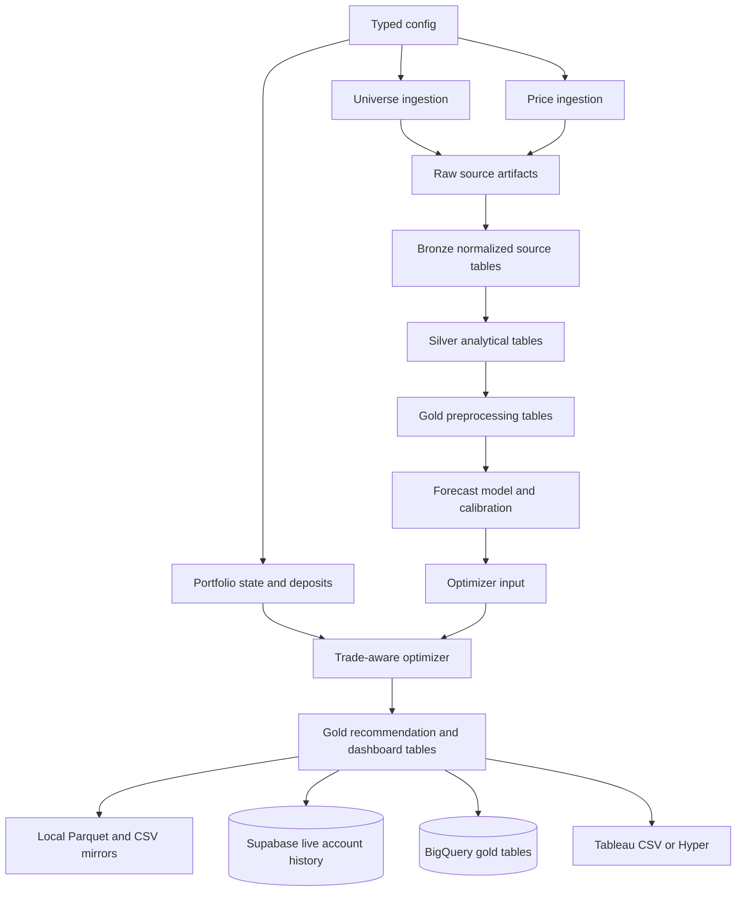
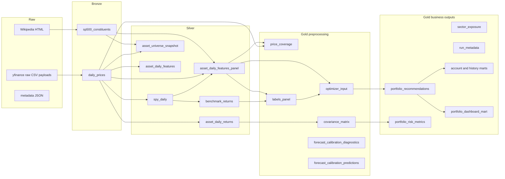

# Preprocessing And Medallion Pipeline

This document describes the current preprocessing pipeline for the stock-analysis project. It
focuses on how source data becomes model features, labels, optimizer inputs, recommendation tables,
and dashboard outputs. It also explains the reasoning behind the main design choices and criticizes
the parts that are still weak.

The implementation is centered in `src/stock_analysis/pipeline/one_shot.py`, with local artifacts
written through `LocalArtifactStore` and cloud artifacts written directly to Cloud Storage through
`GcsArtifactStore`.

## Scope

The pipeline is a one-shot, end-of-day investment decision-support flow. It does not execute trades.
It answers:

- What investable universe is available for this run?
- What market data is available as of the latest provider date?
- Which tickers have usable price history and feature rows?
- What are the point-in-time features and forward-return labels?
- What does the current forecast model expect over the configured horizon?
- Which assets clear the SPY-relative calibrated-return gate?
- Given current holdings, deposits, cash, turnover, and risk constraints, what target allocation and
  executable trade plan should be shown?
- What should be persisted for Tableau, Supabase, BigQuery, and auditability?

The pipeline should be read as a research and analytics system first, and as a live recommendation
assistant second. The data and methodological gaps listed below matter because they can produce
false confidence if they are ignored.

## High-Level Flow



## Execution Contexts

The same medallion pipeline can run in two storage modes.

| Context | Artifact store | Main purpose | Current caveat |
| --- | --- | --- | --- |
| Local one-shot | `data/runs/<run_id>/...` | Local development, Tableau file extracts, debugging | Uses local filesystem; not a shared source of truth unless committed or copied |
| GCP training | `gs://<bucket>/<prefix>/<run_id>/...` plus `gs://<bucket>/models/...` | Train and promote a reusable model bundle in Cloud Storage | Still depends on current source universe and yfinance unless data source changes |
| GCP inference | `gs://<bucket>/<prefix>/<run_id>/...` plus BigQuery publishing | On-demand cloud recommendations and dashboard tables | Account history appears only when live account/repository inputs are available |

The cloud path intentionally creates artifacts directly in Cloud Storage. It does not create a local
run first and upload it later.

## Date Semantics

The pipeline uses two dates that should not be confused:

| Field | Meaning | Why it matters |
| --- | --- | --- |
| `requested_as_of_date` | The date requested by config or CLI. Defaults to the run date. | This is the operator intent. On weekends or holidays it can be after the last market date. |
| `data_as_of_date` | The maximum price date actually returned by the provider. | This is the true feature, forecast, and recommendation date. Tableau should use this for market-data views. |

Forecast windows use `data_as_of_date` as `forecast_start_date`. `forecast_end_date` is derived from
available trading dates where possible, and falls back to a business-day estimate for pending
forecasts.

## Layer Map



## Config Preprocessing

Configuration is not a medallion layer, but it controls every downstream transformation.

Important config groups:

| Config section | Controls |
| --- | --- |
| `run` | Requested date, output root, optional run id |
| `universe` | S&P 500 universe source URL |
| `prices` | Lookback years, batch size, benchmark tickers, coverage gates, stale-data gates |
| `panel_features` | Rolling windows, minimum history, rank features |
| `forecast` | Engine, model version, horizon, calibration, benchmark-return gate |
| `optimizer` | Risk aversion, max weights, turnover penalty, commission, sector caps |
| `portfolio_state` | Scenario holdings and portfolio value |
| `contributions` | Backtest/scenario monthly deposit assumptions |
| `live_account` | Whether actual account state and arbitrary-date deposits come from Supabase |
| `gcp` | Cloud Storage, model registry, BigQuery publishing, contract checks |

Reasoning:

- Centralizing these values in typed Pydantic config makes run behavior auditable and reproducible.
- `run_metadata` stores a config hash and serialized config JSON so a recommendation can be traced
  back to the inputs that produced it.
- The same config object drives local and cloud paths, reducing local/cloud drift.

Critique:

- There is no formal config compatibility version yet. A historical run can store config JSON, but
  there is no migration layer that explains how old config fields map to new fields.
- Some config values combine research assumptions and live operating assumptions. For example,
  `contributions.monthly_deposit_amount` is useful for backtests and scenario runs, while actual
  arbitrary-date deposits belong in Supabase cashflows.
- The config hash excludes `run.as_of_date`, which is useful for comparing equivalent runs across
  dates, but it means the hash alone is not a complete run identity.

## Raw Layer

Raw artifacts preserve source payloads and source metadata before project-level normalization.

| Artifact | Grain | Source | Transformation | Reasoning |
| --- | --- | --- | --- | --- |
| `raw/sp500_constituents/source.html` | One HTML page per run | Wikipedia S&P 500 page | Stored as fetched text | Allows the exact parsed page to be inspected later |
| `raw/sp500_constituents/metadata.json` | One row-like JSON per run | Pipeline metadata | Stores source URL, requested date, and data date | Makes universe provenance explicit |
| `raw/prices/batch_*.csv` | Provider batch payload | yfinance | Provider-native download serialized to CSV | Keeps a copy of what yfinance returned before normalization |
| `raw/prices/metadata.json` | One row-like JSON per run | Pipeline metadata | Stores requested tickers, returned tickers, range, row counts, coverage ratio | Makes data availability and ingestion failures visible |

Main decisions:

- Raw should be source-preserving. It should not clean, filter, rank, or optimize.
- Price downloads are batched to reduce provider calls and handle the full S&P 500 plus benchmark
  candidates.
- The provider request end date is `requested_as_of_date`, but downstream processing uses
  `data_as_of_date`, the latest market date actually returned.

What is good:

- Debuggability is strong for a prototype. If a ticker is missing, stale, or misparsed, the run
  keeps both source metadata and normalized downstream tables.
- The raw layer gives the cloud pipeline the same artifact shape as the local pipeline.

What is weak:

- Wikipedia is not a point-in-time constituent source. Fetching today's constituent table and using
  it for historical labels creates survivorship bias in research and backtesting.
- yfinance is not an immutable institutional data source. Historical adjusted prices can be revised,
  and provider availability can change.
- Raw yfinance CSV payloads are useful for debugging but are not a strict source-of-truth contract.
  There is no checksum manifest per ticker and no vendor entitlement or SLA.

Improvement areas:

- Add a point-in-time S&P 500 membership source with effective dates.
- Store immutable per-run checksums for raw payloads.
- Move production market data to a licensed provider with stable corporate-action and delisting
  handling.

## Bronze Layer

Bronze tables are canonical, validated source tables. They are still source-like, but normalized to
project conventions.

### `bronze/sp500_constituents`

Grain: one ticker per run universe row.

Key transformations:

- Parses the Wikipedia table containing `Symbol`, `Security`, and `GICS Sector`.
- Renames fields to project names such as `ticker`, `security`, `gics_sector`, and
  `gics_sub_industry`.
- Normalizes provider tickers by replacing `.` with `-`, so symbols such as `BRK.B` can be queried
  as `BRK-B`.
- Pads CIK values when present.
- Adds `as_of_date`.
- Optionally appends benchmark candidate rows such as `SPY` with `is_benchmark_candidate = true`.

Reasoning:

- The project needs one canonical ticker identity for portfolio, dashboard, and optimizer outputs,
  and one provider ticker for yfinance queries.
- SPY is deliberately included as an investable benchmark candidate, not only as a comparison
  series. That lets the optimizer hold 100% SPY when active assets do not clear the calibrated gate.

Critique:

- Current constituents are not enough for scientific backtesting. A true historical backtest needs
  membership as of each historical date.
- The ticker identity model is shallow. It does not handle symbol reuse, mergers, spin-offs,
  share-class history, or delisting identity.
- Sector metadata is whatever the current source provides. Historical sector classifications are
  not point-in-time.

### `bronze/daily_prices`

Grain: one ticker and trading date per row.

Key transformations:

- Downloads daily OHLCV from yfinance over `lookback_years`.
- Preserves `open`, `high`, `low`, `close`, `adj_close`, and `volume`.
- Uses `adj_close` for return calculations.
- Adds both `ticker` and `provider_ticker`.
- Drops rows without `adj_close`.
- Merges provider tickers back to canonical constituent tickers where possible.

Reasoning:

- Adjusted close is the right prototype default for return and momentum features because it accounts
  for splits and dividends better than raw close.
- Keeping open/high/low/close/volume gives room for future features even though the current feature
  set mostly uses adjusted close and volume.
- Dropping rows without adjusted close avoids undefined return math.

Critique:

- Adjusted close is revised data. Without vendor snapshots, old runs may not be exactly
  reproducible.
- Dropping bad rows is pragmatic, but it can hide provider anomalies unless combined with coverage
  artifacts and hard gates.
- There is no exchange-calendar normalization. The pipeline trusts provider trading dates.
- Prices are daily only. Intraday deposits or intraday execution are not modeled.

## Silver Layer

Silver tables are analytical transformations over bronze data. They should be reusable across model
training, inference, dashboarding, and audits.

### `silver/spy_daily`

Grain: one SPY row per trading date.

Transformations:

- Filters `daily_prices` to SPY.
- Sorts by date.
- Computes 1-day return from adjusted close.
- Deduplicates by date, keeping the latest row.

Reasoning:

- SPY is the benchmark for both strategy comparison and the investable fallback.
- A clean benchmark series is needed before computing excess returns, forecast outcomes, and account
  performance against same-cashflow SPY.

Critique:

- SPY is investable and convenient, but it is not exactly the S&P 500 index. It includes ETF fees,
  distributions, and market microstructure differences.
- Using only SPY creates a single baseline. A more robust methodology should also compare against
  buy-and-hold current portfolio, equal weight, sector-neutral benchmark, and cash.

### `silver/benchmark_returns`

Grain: one date and horizon per row.

Transformations:

- Computes forward SPY returns for configured horizons, currently 5, 21, and 63 trading days.
- Uses `adj_close.shift(-horizon) / adj_close - 1`.

Reasoning:

- Forward benchmark returns are needed to build active-return labels and realized active-return
  outcomes.
- The horizons are short enough for recommendation tracking and long enough to avoid pure next-day
  noise.

Critique:

- Forward benchmark returns are unavailable for the newest dates. This is correct, but dashboards
  must distinguish pending outcomes from missing data.
- A fixed horizon can miss path risk. A recommendation may be right after 5 days but terrible in the
  interim, or vice versa.

### `silver/asset_daily_returns`

Grain: one ticker and trading date per row.

Transformations:

- Computes 1-day adjusted-close returns per ticker.
- Retains adjusted close and `as_of_date`.

Reasoning:

- This is the common return series for covariance estimation, risk metrics, and future performance
  analysis.

Critique:

- Filling missing values happens later in covariance construction, where missing returns become zero
  after pivoting. That is operationally convenient but statistically questionable for thin or
  interrupted histories.
- Returns are close-to-close and do not include execution timing or bid/ask spread.

### `silver/asset_universe_snapshot`

Grain: one ticker per run universe row.

Transformations:

- Merges constituent metadata with price-history stats.
- Adds `first_price_date`, `last_price_date`, and `history_days`.

Reasoning:

- This table explains why a ticker has or lacks enough data for features and optimization.
- It is useful for Tableau and debugging because it separates universe membership from price
  availability.

Critique:

- History coverage is counted from returned yfinance rows, not from an exchange-specific calendar.
- A ticker can have enough row count but still have stale or problematic data. That is why the newer
  `price_coverage` gold table is also necessary.

### `silver/asset_daily_features_panel`

Grain: one ticker and feature date per row.

Transformations:

- Converts price dates to timestamps and sorts by ticker/date.
- Drops rows without adjusted close.
- Applies rolling windows only from historical data up to the feature date.
- Drops pre-lookback rows until there is enough history.
- Computes:
  - `history_days`
  - 1-day, 5-day, and 21-day recent returns
  - 21-day, 63-day, 126-day, and 252-day momentum
  - 21-day, 63-day, and 126-day annualized volatility
  - 63-day and 252-day max drawdown
  - 50-day and 200-day moving-average ratios
  - 21-day volume z-score and dollar volume
  - SPY-relative excess return windows when benchmark data is present
  - per-date cross-sectional percentile ranks when enabled
- Joins constituent metadata.

Reasoning:

- The model needs point-in-time rows for every historical date, not only latest-date features.
- Rolling windows prevent direct lookahead leakage because features at date `t` use observations up
  to date `t`.
- Cross-sectional ranks help models compare assets in the current opportunity set.
- Liquidity fields support full-universe inference and optional max-asset filtering.

What is good:

- This is one of the strongest parts of the pipeline. It uses a panel structure suitable for
  walk-forward training and latest-date inference.
- It avoids forward-filling future prices into feature rows.
- It keeps feature construction local to price history and benchmark history, making model inputs
  auditable.

Critique:

- The features are point-in-time with respect to prices, but the universe and metadata are not fully
  point-in-time.
- Cross-sectional ranks are computed within the available current universe. With survivorship bias,
  historical ranks can be distorted.
- There is no explicit train-only preprocessing object for transformations such as winsorization,
  scaling, imputation, or regime normalization. Current models mostly avoid that by using tree/rank
  features, but neural models would need stricter preprocessing state.
- Outlier handling is limited. Bad provider spikes can flow into momentum, volatility, and labels.
- Volume features assume volume comparability across symbols and over time; corporate actions and
  changing float can weaken this.

### `silver/asset_daily_features`

Grain: one ticker per run using the latest available date.

Transformations:

- Computes the latest-date heuristic feature summary.
- Produces momentum, moving-average, volatility, drawdown, and eligibility fields.

Reasoning:

- This keeps the older heuristic forecast path simple and fast.
- It also gives Tableau a compact current feature table.

Critique:

- The ML path uses the panel, so this table is secondary. It can drift conceptually from the ML
  feature panel if new features are added to one but not the other.
- Keeping both panel and summary features is useful, but the project should make their intended
  consumers explicit in the data dictionary.

## Gold Preprocessing Layer

Gold preprocessing tables are derived products used to gate data quality, train or score models, and
feed optimization.

### `gold/price_coverage`

Grain: one requested provider ticker per run.

Transformations:

- Starts from the full requested provider ticker list.
- Joins constituent metadata.
- Counts returned price rows.
- Computes first and last price date.
- Computes stale calendar days relative to `data_as_of_date`.
- Flags whether each ticker has a latest feature row.
- Classifies each ticker as:
  - `ok`
  - `missing`
  - `stale`
  - `no_latest_feature`
- Flags whether the row is included in latest inference.
- Enforces configured gates:
  - minimum requested ticker coverage
  - benchmark price availability

Reasoning:

- The model should not silently score only the tickers that happened to return data.
- Per-ticker coverage is necessary for diagnosing why the full universe shrank before inference.
- A hard benchmark gate is required because SPY is both the comparison and fallback asset.

What is good:

- This directly addresses a major operational risk: stale or missing tickers disappearing from the
  latest feature cross-section.
- Coverage metrics are also persisted into `run_metadata`, making Tableau freshness views possible.

Critique:

- Staleness uses calendar days, not an exchange calendar. Holidays and long market closures may need
  better handling.
- The coverage status does not yet classify suspicious price jumps, zero volume streaks, or extreme
  returns.
- The gate is run-level. It does not yet support sector-level or portfolio-exposure-level coverage
  thresholds.

### `gold/labels_panel`

Grain: one ticker and feature date per row, with one set of labels per horizon.

Transformations:

- Aligns labels to feature panel keys.
- Computes forward returns for each configured horizon.
- Computes forward excess returns over SPY when benchmark returns are available.
- Adds per-date forward-return rank and top-tercile flags.

Reasoning:

- The model needs future outcomes aligned to historical feature rows.
- Multiple horizons allow experimentation without rebuilding upstream features.
- Forward excess returns enable SPY-relative research.

Critique:

- The label table is not transaction-cost adjusted. A 5-day forecast that barely beats SPY can still
  be untradable after commission, spread, taxes, and slippage.
- Labels are based on the same current universe problem described above.
- There is no explicit purging of overlapping labels inside `labels_panel`; purging/embargo is done
  in calibration, but broader backtests also need strict split discipline.

### `gold/optimizer_input`

Grain: one latest-date asset candidate per run.

Transformations:

- Selects latest feature rows.
- Optionally filters to top-liquidity tickers if `ml_max_assets` is configured.
- Scores features with the selected model.
- Applies calibration if the artifact or inline model has a valid calibrator.
- Sets:
  - `forecast_score`
  - `calibrated_expected_return`
  - `expected_return`
  - `expected_return_is_calibrated`
  - `calibration_status`
  - `volatility`
  - `eligible_for_optimization`
- Applies the SPY-relative active gate:
  - benchmark candidates can remain eligible
  - active assets must beat SPY calibrated expected return by the configured margin
- Adds model version and feature columns.

Reasoning:

- The optimizer needs expected return and risk in consistent units.
- The system now treats `forecast_score` as a ranking signal and uses calibrated expected return only
  when calibration passes.
- The SPY-relative gate makes the conservative behavior explicit: if active names cannot beat SPY by
  a margin, the optimizer can hold SPY.

What is good:

- Keeping SPY in the optimizer universe is cleaner than forcing an active allocation.
- The calibrated-return gate is a strong product decision because it prevents buying weak active
  names just because their raw model score is positive.
- Full-universe inference is now supported by leaving `ml_max_assets` unset.

Critique:

- Calibration quality can decay by regime. A calibrated 5-day expected return is not guaranteed to
  stay calibrated in new volatility or rate environments.
- The gate compares expected returns but does not explicitly include all implementation costs in
  the expected-return threshold.
- When calibration fails, the system falls back to score units for risk/optimizer output. That is
  useful for debugging but should be considered unsuitable for live trade decisions unless a run
  policy rejects it.

### `gold/covariance_matrix`

Grain: covariance matrix indexed and columned by eligible optimizer ticker.

Transformations:

- Pivots `asset_daily_returns` into a returns matrix.
- Uses the configured trailing lookback.
- Reindexes to eligible optimizer tickers.
- Fills missing returns with zero.
- Computes covariance and scales it to the optimizer return horizon when expected returns are
  calibrated; otherwise scales annualized for score-mode compatibility.
- Adds a small diagonal floor when needed.

Reasoning:

- The optimizer requires a symmetric positive-ish risk matrix.
- Horizon scaling keeps risk closer to expected-return units when expected returns are calibrated.

Critique:

- Filling missing returns with zero can understate risk and correlation.
- Sample covariance is noisy for hundreds of equities and short lookbacks.
- There is no shrinkage covariance, factor model, or robust covariance estimator yet.
- Horizon scaling is approximate; it assumes return independence over the horizon.

### `gold/forecast_calibration_diagnostics`

Grain: one diagnostic row per training or inference run.

Transformations:

- Records calibration method, target, status, observations, validation observations, MAE, RMSE,
  rank information coefficient, horizon, trained-through date, and quality gates.

Reasoning:

- Tableau and run reviews need to know whether expected returns are scientifically interpretable.
- Forecast error is meaningful only when expected returns are calibrated to the same return unit as
  realized returns.

Critique:

- A single diagnostic row hides cross-sectional variation. Calibration may work for large-cap
  technology and fail for lower-liquidity names.
- The current calibration is score-to-return. It does not produce full predictive distributions or
  uncertainty intervals.

### `gold/forecast_calibration_predictions`

Grain: historical calibration prediction row, usually ticker/date.

Transformations:

- Stores model scores, calibrated predictions, realized target values, and split metadata used by
  calibration diagnostics.

Reasoning:

- This makes calibration auditable and lets Tableau show how forecast quality has behaved over time.

Critique:

- This is not yet a full model monitoring table. It should eventually include feature drift,
  prediction drift, realized decile performance, and stability by sector/liquidity bucket.

## Portfolio State And Cashflow Preprocessing

Portfolio state enters after market preprocessing and before optimization.

### Scenario Mode

Scenario mode is used when `live_account.cashflow_source != "actual"`.

Transformations:

- Loads current holdings from config or a holdings file when available.
- Uses configured portfolio value.
- Applies `contributions.monthly_deposit_amount` as the contribution for the run.

Reasoning:

- This mode is simple and reproducible for backtests, demos, and local what-if analysis.
- Keeping the monthly deposit assumption in backtesting creates a stable comparison across
  strategies.

Critique:

- Scenario deposits are not an accounting ledger. They do not represent arbitrary real deposit
  dates, settlement, or actual brokerage cash.

### Actual Mode

Actual mode is used when `live_account.cashflow_source = "actual"` with Supabase enabled.

Transformations:

- Loads the account by slug.
- Loads the latest portfolio snapshot on or before `data_as_of_date`.
- Loads holding rows for that snapshot.
- Loads cashflows up to the data date.
- Selects settled cashflows after the latest snapshot that have not yet been included in a snapshot.
- Rejects negative net cashflow after the latest snapshot.
- Builds current weights and market values.

Reasoning:

- Deposits can happen on arbitrary dates and should be registered as cashflows, not assumed to occur
  at month-end.
- The latest snapshot is treated as the system's current portfolio balance.
- Cashflows after the snapshot become available cash for recommendations until a new snapshot
  includes them.

What is good:

- Reruns can use the latest persisted snapshot and cashflows instead of manual state.
- The recommendation history can be tied to account state, cashflows, and subsequent performance.

Critique:

- This is still not a broker-grade ledger. It does not model tax lots, partial fills, order status,
  fees outside commissions, FX, or unsettled trades in depth.
- Negative cashflows require a fresh snapshot. That is conservative but operationally restrictive.
- Supabase remains the account-history source for local/live runs; the GCP BigQuery path is
  dashboard-oriented and does not replace the account repository yet.

## Forecast Model Training And Inference

There are two ML execution patterns.

| Pattern | What happens | Reasoning | Caveat |
| --- | --- | --- | --- |
| Inline local ML | The one-shot run prepares data, trains, calibrates, scores, optimizes, and writes outputs | Useful for local research and end-to-end testing | Training and inference are coupled, so it is less production-like |
| GCP training + inference | Training job prepares medallion data, trains/calibrates, writes a model bundle to Cloud Storage; inference loads the promoted bundle and scores current features | Better separation of training and inference; model artifact can be audited | The model still inherits data-source and universe limitations |

The GCS model bundle includes:

- `model.cloudpickle`
- `metadata.json`
- `manifest.json`
- `calibration_diagnostics.parquet`
- `calibration_predictions.parquet`
- optional production pointer at `current.json`

Inference validates the model artifact contract:

- model version
- horizon days
- target column
- score scale
- trained-through date versus inference data date
- required feature columns
- calibration method and target when calibrated expected returns are required

Reasoning:

- Contract validation prevents loading a stale or incompatible model silently.
- The manifest/pointer design makes production promotion more atomic than checking only for a model
  pickle.

Critique:

- `cloudpickle` is practical, but it is not a portable model format. Python and dependency versions
  matter.
- The model artifact does not yet include a formal feature schema with dtypes, null policy, and
  preprocessing transformers.
- There is no model registry database beyond Cloud Storage files and metadata.

## Optimizer And Recommendation Preprocessing

The optimizer consumes `optimizer_input`, covariance, and current portfolio state.

Transformations:

- Filters to rows with `eligible_for_optimization = true`.
- Applies max-weight bounds, including a separate benchmark-candidate max weight.
- Uses a long-only cvxpy optimization:
  - maximize expected return
  - penalize covariance risk
  - penalize turnover versus current weights
  - penalize commission-related turnover
  - optionally limit total trade size
  - optionally cap sector exposure excluding benchmark candidates
- Preserves outside-universe holdings when configured.
- Builds recommendation rows with current weight, target weight, trade weight, notional trade,
  commissions, deposit usage, executable target, no-trade-band flags, action, and reason code.
- Attaches forecast outcomes as pending, realized, or unavailable.

Reasoning:

- The user should not see only target weights. They need an executable trade plan that respects
  available cash, deposits, commissions, and no-trade bands.
- Turnover penalties and no-trade bands are necessary because rerunning every day should not force
  unnecessary rebalances.
- Allowing SPY to reach 100% prevents forced diversification into weak assets.

Critique:

- The optimizer assumes fractional weights. It does not model whole-share constraints.
- Commission is modeled simply and does not include spread, market impact, tax, or broker-specific
  fee schedules.
- The covariance and expected-return estimates are noisy; optimization can amplify small errors.
- The objective is single-period. It does not optimize over a multi-step deposit or rebalance
  schedule.

## Dashboard And Persistence Outputs

### Gold recommendation tables

| Table | Grain | Purpose |
| --- | --- | --- |
| `portfolio_recommendations` | ticker per run | Current recommendation lines and executable trade fields |
| `portfolio_risk_metrics` | metric per run | Portfolio expected return, expected volatility, holdings, concentration |
| `sector_exposure` | sector per run | Target sector weights |
| `run_metadata` | run | Audit fields, config, data freshness, calibration, account context |
| `portfolio_dashboard_mart` | ticker per run | Tableau-friendly wide table for current-run recommendations |

### Account and history tables

When live account data is available, the pipeline can produce:

- `cashflows`
- `portfolio_snapshots`
- `holding_snapshots`
- `recommendation_runs`
- `recommendation_lines`
- `performance_snapshots`
- `cashflows_history`
- `portfolio_snapshots_history`
- `holding_snapshots_history`
- `recommendation_runs_history`
- `recommendation_lines_history`
- `performance_snapshots_history`

Reasoning:

- Current-run tables explain what the model recommends now.
- History tables let Tableau show recommendation history, forecast outcomes, deposits, holdings, and
  account performance versus same-cashflow SPY.
- Supabase remains the live account source of truth for local/live account history.
- BigQuery is the cloud analytics surface for dashboard publishing.

Critique:

- History output availability depends on live account configuration and repository access. A cloud
  run without live account inputs will publish current-run analytics but not full account history.
- Tableau output is good for analysis, but it is not an operational audit log by itself.
- There is no broker execution table yet, so recommendations and executed trades can diverge unless
  the user imports a fresh snapshot after acting.

## Data Contracts And Quality Gates

Current safeguards:

| Safeguard | Where it happens | What it protects |
| --- | --- | --- |
| Required-column validation | `domain/schemas.py` | Prevents malformed core tables from being silently written |
| Raw metadata | Raw layer | Preserves source URL, requested date, returned tickers, row counts |
| Price coverage gate | `price_coverage` | Fails the run when usable ticker coverage is too low |
| Benchmark gate | `price_coverage` | Fails the run when SPY is missing or unusable |
| Feature minimum history | Feature panel and latest features | Prevents immature histories from being scored |
| Calibration gates | Forecast calibration | Prevents score units from being treated as return forecasts |
| Model contract validation | GCP inference | Prevents incompatible model artifacts from scoring current features |
| Atomic-ish BigQuery publish | BigQuery staging tables and transactions | Reduces risk of deleting a run before replacement rows load |
| Supabase pagination | Repository reads | Avoids truncating long account/recommendation history |

What is good:

- The project has moved beyond "download data and hope" into explicit quality gates.
- The most important user-facing distinction, score versus calibrated expected return, is now encoded
  in tables and metadata.
- Dashboard fields expose freshness, calibration, forecast horizon, and forecast outcomes.

What is missing:

- A full data test suite with row-count expectations, null thresholds, uniqueness checks, range
  checks, and outlier checks.
- Feature schema versioning with explicit dtype and null policies.
- Provider-level reconciliation against a second market data source.
- Formal lineage metadata connecting every table to exact upstream artifact URIs.
- Great Expectations, pandera, or equivalent validation could help, but the immediate need is clear
  domain-specific tests, not tooling for its own sake.

## What Is Strong In The Current Design

- The medallion separation is clear. Raw, bronze, silver, gold preprocessing, and gold business
  outputs each have different responsibilities.
- Raw source preservation and metadata make debugging possible.
- The feature panel is built in a point-in-time style with rolling windows and no future prices in
  feature rows.
- SPY is treated consistently as benchmark, fallback asset, and same-cashflow comparison.
- The optimizer considers current holdings, deposits, commissions, turnover, no-trade bands, and
  sector limits.
- Calibrated expected returns are separated from raw model scores, which avoids a common scientific
  error.
- Supabase captures live account history, while BigQuery supports dashboard analytics in GCP.
- GCP training and inference are split, and model artifacts are stored in Cloud Storage without
  Vertex AI.

## Most Important Weaknesses

### Methodology

- Historical universe membership is not point-in-time. This is the biggest scientific weakness.
- yfinance is acceptable for a prototype but not for reliable production or serious performance
  claims.
- Labels are not cost-adjusted, tax-adjusted, or liquidity-adjusted.
- Covariance estimation is simple and likely unstable for large universes.
- Calibration is useful but not enough to claim stable predictive skill across regimes.
- Backtests need stronger walk-forward controls, statistical confidence intervals, and sensitivity
  analysis before claiming the model beats SPY.

### Product

- Recommendations are not execution records. The product needs an explicit execution/import loop.
- Whole-share constraints and actual broker cash are not fully modeled.
- BigQuery is an analytics layer, not yet a full replacement for Supabase account history.
- Tableau can show history and forecast outcomes only when the account/recommendation history tables
  are populated.
- The dashboard data dictionary should be formalized so every Tableau field has units and intended
  interpretation.

### Operations

- Market data freshness uses calendar staleness rather than an exchange calendar.
- There is no provider fallback when yfinance partially fails.
- Cloud model artifacts are file-based; this is simple, but lifecycle management and retention
  policies should be made explicit.
- There is no alerting when coverage, calibration, or BigQuery publish degrades.

## Recommended Improvement Roadmap

### Priority 1: Scientific Validity

1. Add point-in-time S&P 500 constituents with effective dates.
2. Add domain data tests for prices, features, labels, and optimizer inputs.
3. Add cost-aware labels or require the forecast gate to clear estimated implementation costs.
4. Add walk-forward backtests with confidence intervals versus SPY, current-holdings buy-and-hold,
   equal weight, and cash.
5. Add robust covariance estimation, such as shrinkage or factor covariance.

### Priority 2: Production Data Contracts

1. Add a formal feature schema manifest to model artifacts.
2. Persist upstream artifact URIs and checksums in run metadata.
3. Add exchange-calendar-aware freshness checks.
4. Add outlier detection for price jumps, zero/negative prices, missing volume, and suspicious
   return spikes.
5. Add cloud retention rules for raw, medallion, and model artifacts.

### Priority 3: Account And Dashboard Maturity

1. Add execution records so recommendations can be compared with actual trades.
2. Add whole-share and broker cash constraints to executable recommendations.
3. Publish account history consistently to BigQuery when the cloud run has account access.
4. Add a Tableau data dictionary with units:
   - score
   - 5-day calibrated expected return
   - realized return
   - active return versus SPY
   - forecast error
   - trade notional
   - deposit usage
5. Add dashboard-level warning fields for stale data, uncalibrated forecasts, missing benchmark,
   and incomplete account history.

## How To Inspect A Run

Local artifact layout:

```text
data/runs/<run_id>/
  raw/
  bronze/
  silver/
  gold/
```

Useful local files:

```text
data/runs/<run_id>/raw/prices/metadata.json
data/runs/<run_id>/gold/csv/price_coverage.csv
data/runs/<run_id>/gold/csv/forecast_calibration_diagnostics.csv
data/runs/<run_id>/gold/csv/optimizer_input.csv
data/runs/<run_id>/gold/csv/portfolio_recommendations.csv
data/runs/<run_id>/gold/csv/run_metadata.csv
data/runs/<run_id>/gold/csv/portfolio_dashboard_mart.csv
```

Cloud artifact layout:

```text
gs://<bucket>/<gcs_prefix>/<run_id>/
  raw/
  bronze/
  silver/
  gold/

gs://<bucket>/<model_registry_prefix>/
  runs/<training_run_id>/
  production/current.json
```

For a dashboard review, start with:

1. `run_metadata`: check `data_as_of_date`, `price_coverage_ratio`,
   `expected_return_is_calibrated`, `optimizer_return_unit`, `calibration_status`, and
   `model_contract_status`.
2. `price_coverage`: check missing, stale, and no-latest-feature tickers.
3. `forecast_calibration_diagnostics`: check whether the run is allowed to interpret expected
   returns as percent return forecasts.
4. `optimizer_input`: check SPY expected return, active gate status, volatility, and eligibility.
5. `portfolio_recommendations`: check action, reason code, executable target, trade notional,
   forecast horizon, and outcome status.
6. Account history tables: check whether deposits, snapshots, holdings, recommendation history, and
   performance history are populated.

## Bottom Line

The current preprocessing architecture is directionally good: it has clear layers, auditable
artifacts, point-in-time feature construction, explicit data-quality gates, calibrated forecast
semantics, and dashboard-ready outputs. The main concern is not the software structure; it is
scientific validity under real historical conditions. The highest-impact improvement is a
point-in-time universe and stronger data tests. After that, the next major product improvement is a
true execution ledger so recommendations, actual buys/sells, deposits, and performance can be
closed into one account lifecycle.
