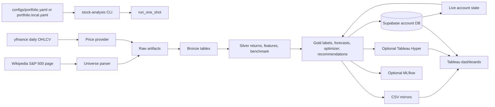
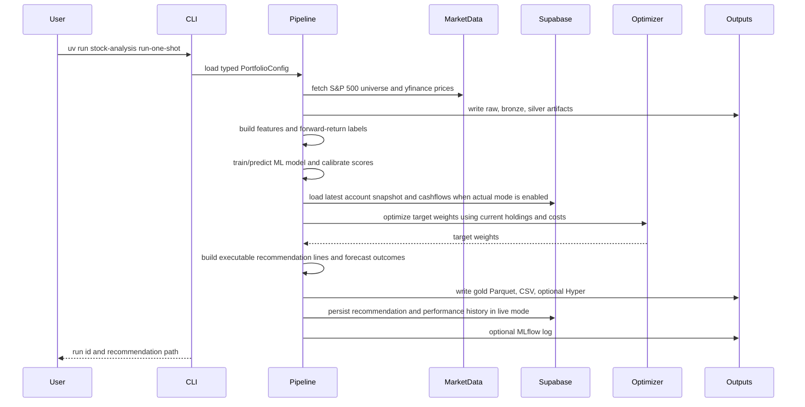
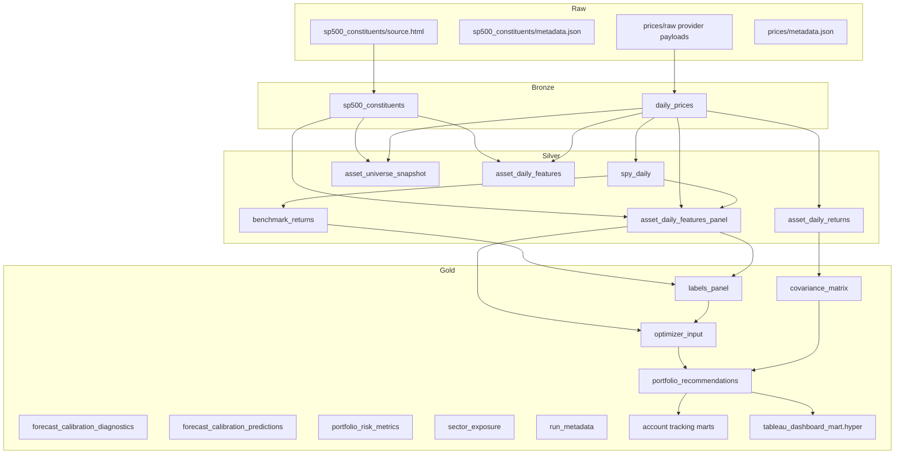
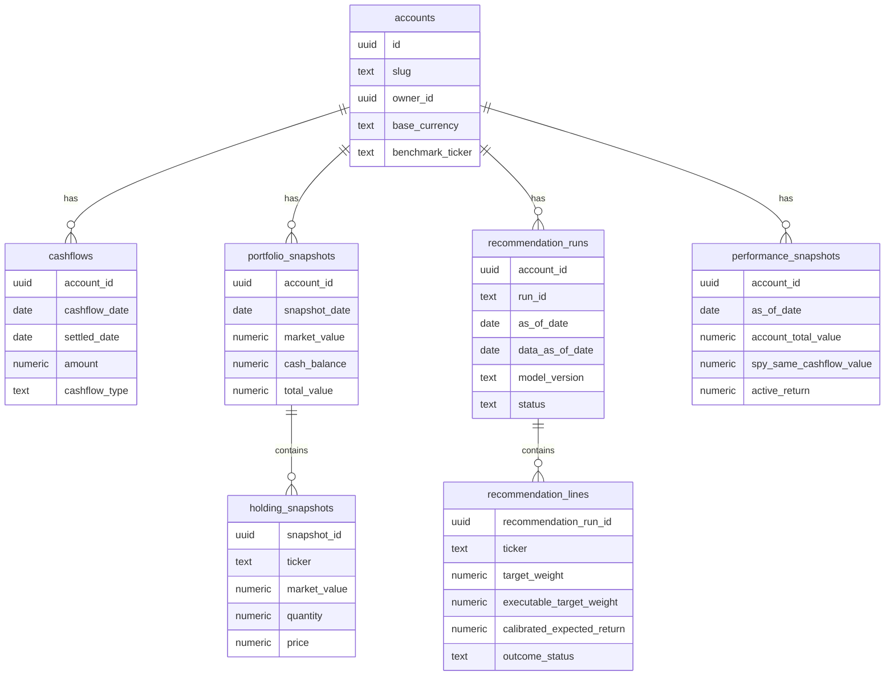
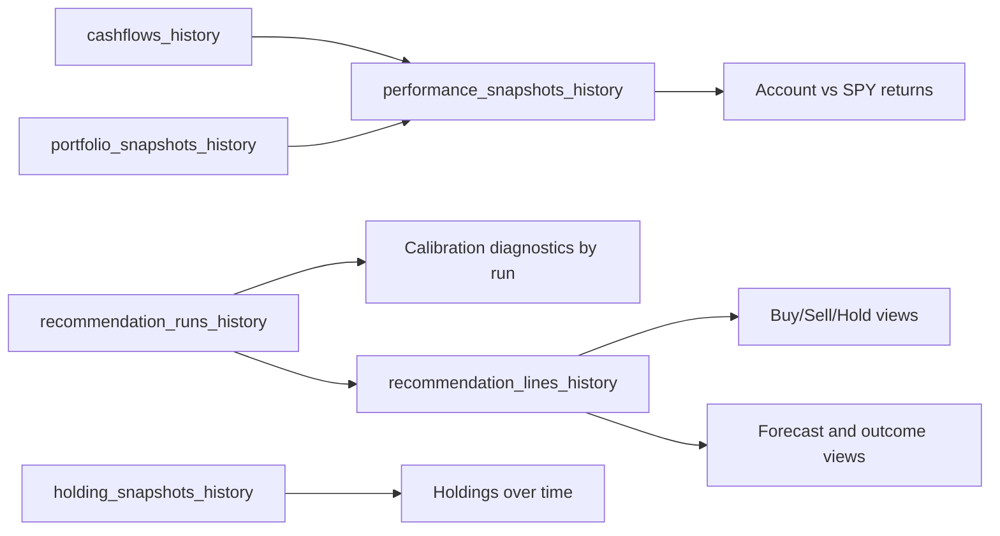

# Project Current State

Status date: 2026-05-02

This document describes the current architecture, stack, data processing flow, medallion schema,
modeling approach, Tableau outputs, Supabase account tracking, and the main operational caveats of
the stock-analysis project.

The project is a one-shot, end-of-day S&P 500 portfolio assistant. It is designed to ingest a current
S&P 500 universe, download historical end-of-day prices, build medallion data products, train or run
a forecast model, optimize a long-only portfolio, persist account recommendation history, and emit
Tableau-ready datasets. It is a decision-support and research system. It does not execute trades.

## Executive Summary

The current product can answer this workflow:

1. What is my latest portfolio state?
2. What deposits or cashflows have I registered?
3. What market data is available as of the current run?
4. Which assets have enough history and a model forecast?
5. Does an active asset beat SPY's calibrated 5-trading-day expected return by the configured margin?
6. Given current holdings, cash, turnover costs, commissions, and risk constraints, what target
   allocation and executable trades should I see?
7. How did prior recommendations perform after their forecast horizon?
8. How is my account performing against a same-cashflow SPY benchmark?
9. What should Tableau visualize for current recommendations, recommendation history, forecasts,
   cashflows, holdings, and performance?

Implemented today:

- Medallion outputs under `data/runs/<run_id>/`.
- Current S&P 500 universe ingestion from Wikipedia.
- Historical daily price ingestion from `yfinance`.
- Feature panel and forward-return labels.
- Heuristic and ML forecast engines.
- Current default ML candidate: `lightgbm_return_zscore`.
- Isotonic calibration from model scores to 5-trading-day returns when validation gates pass.
- SPY included as an optimizer candidate and as the performance baseline.
- Active-name buy gate requiring calibrated expected return to beat SPY by a margin.
- Long-only, trade-aware optimization with turnover, commission, sector, max-weight, and benchmark
  allocation controls.
- Supabase account, cashflow, snapshot, holding, recommendation, and performance history.
- Tableau CSV and optional Hyper extracts, including current-run and historical account marts.
- MLflow logging when enabled.
- Autoresearch and backtest harnesses for model and optimizer experiments.

Important current caveats:

- The current production model is provisional. Backtests beat SPY on point estimates in some tested
  settings, but the evidence does not yet support a statistically confirmed "we beat SPY" claim.
- The configured live profile is intentionally more aggressive than the risk-adjusted default found
  in the broad conservative backtest. It can rotate more and draw down more.
- The one-shot universe uses the current S&P 500 constituents. Research backtests are point-in-time
  for features and labels, but historical constituent membership is still a key improvement area.
- `yfinance` is a prototype data source. Production use should move to a licensed market data
  provider.
- Recommendations are not broker execution records. After manually executing trades, import a fresh
  portfolio snapshot before rerunning.

## Technology Stack

| Area | Current Stack | Role |
| --- | --- | --- |
| Language | Python 3.12 | Main implementation language |
| CLI | Typer, Rich | `stock-analysis` command-line interface |
| Configuration | Pydantic, PyYAML, python-dotenv | Typed YAML config plus local `.env` credentials |
| DataFrames | pandas, numpy | Transformation, features, outputs |
| Storage files | Parquet via pyarrow, CSV mirrors | Medallion artifacts and Tableau Prep inputs |
| Web ingestion | requests, lxml | S&P 500 universe HTML fetch and parse |
| Market data | yfinance | Historical end-of-day OHLCV data |
| Forecasting | scikit-learn, LightGBM, CatBoost, optional PyTorch | Model candidates and calibration |
| Optimization | cvxpy | Long-only portfolio optimization |
| Experiment tracking | optional MLflow | Run metrics and artifacts |
| Account database | optional Supabase | System of record for live account history |
| BI output | Tableau CSV, optional Tableau Hyper API | Tableau dashboard datasets |
| Tableau publishing | optional Tableau Server Client | Publishing datasource/workbook |
| Quality | Ruff, mypy, pytest | Formatting, linting, typing, tests |
| Issue tracking | bd, beads | Local project task tracking |

Optional dependency groups:

```bash
uv sync --dev
uv sync --extra mlflow --dev
uv sync --extra supabase --dev
uv sync --extra tableau --dev
uv sync --extra pytorch --dev
```

The optional PyTorch stack includes MLP, LSTM, and Transformer candidate implementations, with Apple
Silicon `mps` support when available. Those models are research candidates, not the current
production default.

## Repository Map

| Path | Purpose |
| --- | --- |
| `src/stock_analysis/cli.py` | Typer CLI commands |
| `src/stock_analysis/pipeline/one_shot.py` | Main one-shot orchestration flow |
| `src/stock_analysis/config.py` | Typed configuration models |
| `src/stock_analysis/ingestion/` | Universe and price ingestion |
| `src/stock_analysis/medallion/` | Bronze and silver write helpers |
| `src/stock_analysis/features/` | Point-in-time asset features |
| `src/stock_analysis/ml/` | Labels, experiment runners, model candidates, MLflow logging |
| `src/stock_analysis/forecasting/` | Forecast engines, calibration, forecast outcomes |
| `src/stock_analysis/optimization/` | Portfolio optimizer and recommendation table builder |
| `src/stock_analysis/portfolio/` | Holdings, rebalance context, live account state |
| `src/stock_analysis/storage/` | Supabase contracts and repository implementation |
| `src/stock_analysis/tableau/` | Tableau marts, Hyper export, workbook generation, publishing |
| `src/stock_analysis/backtest/` | Backtest runner |
| `src/stock_analysis/benchmarks/` | SPY benchmark helpers |
| `configs/portfolio.yaml` | Tracked default runtime config |
| `configs/portfolio.local.yaml` | Local ignored config, used for credentials/live account settings |
| `supabase/migrations/` | Local/remote Supabase schema migrations |
| `runbooks/` | Operator runbooks |
| `docs/` | Methodology, dashboard design, experiment reports, architecture docs |
| `tableau/` | Tableau Prep specs, workbook templates, publish notes |
| `tests/` | Unit, integration, and ML tests |

## Current Runtime Configuration

The default tracked config is `configs/portfolio.yaml`.

Key defaults:

```yaml
prices:
  provider: yfinance
  lookback_years: 5
  benchmark_tickers: [SPY]
  include_benchmark_tickers_in_universe: true

forecast:
  engine: ml
  ml_model_version: lightgbm_return_zscore
  ml_horizon_days: 5
  ml_max_assets: null
  ml_calibration_enabled: true
  ml_calibration_method: isotonic
  ml_use_calibrated_expected_return: true
  ml_min_active_expected_return_vs_benchmark: 0.001

optimizer:
  max_weight: 0.24
  benchmark_candidate_max_weight: 1.0
  risk_aversion: 4.0
  lambda_turnover: 0.005
  commission_rate: 0.002
  sector_max_weight: 0.35
  preserve_outside_holdings: true

execution:
  no_trade_band: 0.01

live_account:
  enabled: false
  account_slug: null
  cashflow_source: scenario

tableau:
  export_csv: true
  export_hyper: false

mlflow:
  enabled: true
  tracking_uri: sqlite:///data/mlflow/mlflow.db
```

Interpretation:

- `ml_max_assets: null` means the live ML inference universe uses the full eligible asset universe,
  not only the top 100 names.
- `include_benchmark_tickers_in_universe: true` adds SPY as an investable benchmark candidate.
- `benchmark_candidate_max_weight: 1.0` allows the optimizer to hold 100% SPY when no active asset
  clears the calibrated SPY-relative expected-return gate.
- `ml_min_active_expected_return_vs_benchmark: 0.001` requires a non-benchmark asset to beat SPY's
  calibrated 5-day expected return by at least 10 bps before it can be a new optimized holding.
- `risk_aversion: 4.0`, `lambda_turnover: 0.005`, and `no_trade_band: 0.01` are the current
  aggressive live settings.
- `live_account.cashflow_source: scenario` uses the configured scenario deposit amount. For actual
  deposits on arbitrary dates, use `live_account.cashflow_source: actual` with Supabase enabled.

## High-Level Architecture



## Main One-Shot Processing Flow

`stock-analysis run-one-shot` calls `run_one_shot` in
`src/stock_analysis/pipeline/one_shot.py`.



Step-by-step:

1. Resolve `requested_as_of_date`.
   - If `run.as_of_date` is null, the requested date is today's local date.
   - The final data date is `data_as_of_date`, the latest price date returned by the data provider.

2. Build the universe.
   - Fetch the Wikipedia S&P 500 table.
   - Parse tickers, security names, GICS sector and sub-industry.
   - Normalize provider tickers for `yfinance`.
   - Add benchmark tickers, currently SPY, as synthetic benchmark candidate rows when configured.

3. Download prices.
   - Download daily OHLCV history over the configured lookback period.
   - Merge prices back to canonical project tickers.
   - Persist raw payload metadata and source artifacts.

4. Write bronze.
   - Validate and write the cleaned constituents and daily prices tables.

5. Build silver.
   - Build SPY daily returns.
   - Build SPY forward benchmark returns for configured horizons.
   - Build asset daily returns.
   - Build the asset universe snapshot.
   - Build point-in-time daily feature panels.

6. Build gold forecast inputs.
   - Build forward-return labels.
   - Train the selected ML model or run the heuristic forecaster.
   - Build latest-date optimizer input and covariance matrix.
   - Write calibration diagnostics and prediction artifacts.

7. Load portfolio state.
   - Scenario mode loads holdings from a local file or initial portfolio value.
   - Actual mode loads account, latest snapshot, holdings, and settled cashflows from Supabase.

8. Optimize.
   - Align current weights.
   - Preserve holdings outside the optimizer universe when configured.
   - Solve a long-only cvxpy problem.

9. Build recommendations.
   - Attach forecast semantics.
   - Compute current, target, trade, executable target, commission, deposit usage, and reason fields.
   - Apply the no-trade band and minimum rebalance threshold.
   - Attach forecast horizon outcomes as pending, realized, or unavailable.

10. Build Tableau/account marts.
    - Current-run recommendation, risk, sector, account, and performance tables.
    - Historical Supabase-backed account tables when credentials are available.

11. Persist live history.
    - For actual account mode, persist recommendation runs, recommendation lines, and performance
      snapshots back to Supabase.
    - Older completed recommendation runs for the same account/date are superseded.

12. Log and return.
    - Optional MLflow logging records parameters, metrics, and artifacts.
    - The CLI prints the run id and recommendation path.

## Medallion Schema

All generated run artifacts are scoped by run id:

```text
data/runs/<run_id>/
  raw/
  bronze/
  silver/
  gold/
```

CSV mirrors are nested under each layer:

```text
data/runs/<run_id>/<layer>/csv/<table>.csv
```

### Medallion Flow



### Raw Layer

Raw contains source-preserving artifacts and metadata.

| Path | Description |
| --- | --- |
| `raw/sp500_constituents/source.html` | Fetched Wikipedia S&P 500 page HTML |
| `raw/sp500_constituents/metadata.json` | Source URL, requested date, market data date |
| `raw/prices/<payload files>` | Price provider payloads when available |
| `raw/prices/metadata.json` | Provider, requested range, returned row count, raw file list |

Use raw when debugging ingestion or verifying what upstream data was available to a run.

### Bronze Layer

Bronze tables are cleaned, validated versions of ingested source data.

| Table | Key Columns | Purpose |
| --- | --- | --- |
| `bronze/sp500_constituents` | `ticker`, `provider_ticker`, `security`, `gics_sector`, `gics_sub_industry`, `as_of_date` | Canonical current universe plus benchmark candidate rows |
| `bronze/daily_prices` | `ticker`, `provider_ticker`, `date`, `open`, `high`, `low`, `close`, `adj_close`, `volume`, `as_of_date` | Daily OHLCV history for universe and benchmark tickers |

Bronze should stay close to source facts. It should not contain portfolio recommendations.

### Silver Layer

Silver tables are analytical transformations over bronze.

| Table | Purpose |
| --- | --- |
| `silver/spy_daily` | SPY adjusted close and 1-day return series |
| `silver/benchmark_returns` | Forward SPY returns by configured horizon, currently 5, 21, and 63 days |
| `silver/asset_daily_returns` | Per-asset adjusted close and 1-day return |
| `silver/asset_universe_snapshot` | Per-asset price-history coverage and metadata |
| `silver/asset_daily_features_panel` | Point-in-time panel features used by ML training and inference |
| `silver/asset_daily_features` | Latest-date feature summary used by the heuristic forecast path |

The feature panel is the main modeling table. It includes price-derived features such as momentum,
volatility, drawdown, moving-average ratios, recent returns, volume z-scores, and optional
cross-sectional ranks.

### Gold Layer

Gold tables are business-facing and model-facing outputs.

| Table | Purpose |
| --- | --- |
| `gold/labels_panel` | Forward-return labels used for ML training/evaluation |
| `gold/optimizer_input` | Latest-date forecast, calibrated expected return, volatility, eligibility, benchmark gate fields |
| `gold/covariance_matrix` | Covariance matrix aligned to optimizer tickers |
| `gold/forecast_calibration_diagnostics` | Calibration status, quality metrics, validation counts |
| `gold/forecast_calibration_predictions` | Calibration fit/validation predictions |
| `gold/portfolio_recommendations` | Current-run recommendation lines by ticker |
| `gold/portfolio_risk_metrics` | Portfolio-level expected return, expected volatility, holding count, concentration |
| `gold/sector_exposure` | Target weight by GICS sector |
| `gold/run_metadata` | Run date, data freshness, config hash, model/calibration metadata |
| `gold/cashflows` | Current-run account cashflows, live mode only |
| `gold/portfolio_snapshots` | Current-run account valuation snapshots, live mode only |
| `gold/holding_snapshots` | Current-run account holdings snapshots, live mode only |
| `gold/recommendation_runs` | Current-run recommendation run metadata, live mode only |
| `gold/recommendation_lines` | Current-run recommendation line facts, live mode only |
| `gold/performance_snapshots` | Current-run account performance history, live mode only |
| `gold/*_history` | Supabase-backed historical account, recommendation, and performance tables |
| `gold/tableau_dashboard_mart.hyper` | Optional multi-table Tableau Hyper extract |

## Forecasting And Model State

### Current Production Default

The default forecast engine is ML:

```yaml
forecast:
  engine: ml
  ml_model_version: lightgbm_return_zscore
  ml_horizon_days: 5
```

`lightgbm_return_zscore` is a LightGBM regression model trained on 5-trading-day forward returns.
Its raw predictions are transformed into cross-sectional z-scores for ranking. The live pipeline
then attempts to calibrate those scores into actual 5-trading-day expected returns.

Production semantics:

- `forecast_score` is always the raw ranking/optimization signal.
- `calibrated_expected_return` is populated only when calibration is valid.
- `expected_return` equals `calibrated_expected_return` only when
  `expected_return_is_calibrated = true`.
- `optimizer_return_unit` in `run_metadata` is `5d_return` when calibrated, otherwise `score`.
- `forecast_horizon_days` is currently 5.
- `forecast_start_date` is the market data date.
- `forecast_end_date` is the planned or realized horizon end date.

### Calibration

The calibration flow:

1. Train the selected model using historical rows before the latest inference date.
2. Produce model scores for historical calibration observations.
3. Fit an isotonic score-to-return calibrator.
4. Validate on a later holdout split with an embargo.
5. Promote `expected_return` to calibrated return only when validation gates pass.

Configured gates include:

- Minimum total calibration observations.
- Minimum validation observations.
- Minimum rank information coefficient.
- Optional MAE/RMSE caps.
- Embargo between calibration training and validation.
- Shrinkage of calibrated expected returns.

This matters because forecast error is only scientifically valid when comparing a realized return to
a calibrated expected return. If calibration is not valid, `forecast_score` should be shown in
Tableau as a ranking/confidence signal, not as a predicted percent return.

### SPY-Relative Active Gate

SPY is both:

- The benchmark used for account and strategy comparison.
- An optimizer candidate that can receive up to 100% allocation.

The current active gate:

```text
active asset is eligible if:
calibrated_expected_return >= SPY_calibrated_expected_return + 0.001
```

If calibration is unavailable, active assets cannot pass this SPY-relative calibrated-return gate.
SPY can still be selected as the full allocation.

### Neural Models

PyTorch MLP, LSTM, and Transformer candidates are implemented for autoresearch:

- `torch_mlp_*`
- `torch_lstm_*`
- `torch_transformer_*`

The latest documented neural research found that the best neural sequence model beat SPY on some
point estimates, but it did not beat the current LightGBM candidate under the tested cost-aware
point-in-time contract. LSTM and Transformer models should remain research baselines until they
provide incremental, cost-adjusted, out-of-sample value over LightGBM.

### Methodology Status

Current evidence from `docs/experiments/autoresearch-summary.md`:

- The strongest broad-confirmed point-estimate candidate was `lightgbm_return_zscore`.
- It beat SPY on ending value and risk metrics in tested production-economics runs.
- It did not clear the strict bootstrap/statistical confirmation gate.
- The product should not state "we conclusively beat SPY" yet.

Current conservative versus aggressive evidence from
`docs/experiments/conservative-vs-aggressive-user300-full-universe-20260428.md`:

- Aggressive produced higher ending value in that test.
- Conservative had better risk-adjusted metrics, lower drawdown, and far lower turnover.
- Neither profile had a Sharpe-difference confidence interval that excluded zero.
- Existing autoresearch backtests did not yet replay the exact live calibrated SPY-gated workflow.
  Follow-up bead `stock-analysis-d5g` tracks that gap.

## Optimization And Recommendation Logic

The optimizer solves a long-only cvxpy problem over eligible assets.

Objective, conceptually:

```text
maximize:
  expected_return_weighted_score
  - risk_aversion * portfolio_variance
  - lambda_turnover * turnover
  - commission_rate * traded_weight
```

Core constraints:

- Sum of optimized weights equals 1 within the investable optimizer universe.
- All weights are nonnegative.
- Regular assets are capped by `optimizer.max_weight`.
- Benchmark candidate assets, currently SPY, are capped by `optimizer.benchmark_candidate_max_weight`.
- Sector exposure is capped by `optimizer.sector_max_weight` for non-benchmark assets.
- Optional max absolute trade constraint can cap total turnover.

Current live profile:

| Setting | Value | Meaning |
| --- | ---: | --- |
| `max_weight` | 0.24 | Regular active names can reach 24% |
| `benchmark_candidate_max_weight` | 1.0 | SPY can remain 100% |
| `risk_aversion` | 4.0 | More aggressive than conservative research default |
| `lambda_turnover` | 0.005 | Low turnover penalty |
| `commission_rate` | 0.002 | 0.2% modeled cost on traded notional |
| `sector_max_weight` | 0.35 | Non-benchmark sector cap |
| `no_trade_band` | 0.01 | Trades below 1% are suppressed in execution fields |

Recommendation line semantics:

| Field | Meaning |
| --- | --- |
| `current_weight` | Current holding weight before contribution |
| `target_weight` | Solver target weight |
| `executable_target_weight` | Target after applying no-trade and rebalance execution rules |
| `trade_weight` | Target minus current weight |
| `trade_notional` | Dollar trade estimate |
| `commission_amount` | Dollar commission estimate |
| `deposit_used_amount` | Deposit amount used for the line |
| `cash_after_trade_amount` | Cash estimate after planned trade |
| `action` | `BUY`, `SELL`, `HOLD`, or `EXCLUDE` |
| `reason_code` | Main reason for the displayed action |
| `no_trade_band_applied` | Whether a small trade was suppressed |
| `rebalance_required` | Whether the line requires action under thresholds |

The optimizer uses current balance when live account tracking is enabled. It does not infer that a
previous recommendation was executed. After you buy/sell manually, import a fresh snapshot so the
next run sees the real holdings.

## Account Tracking In Supabase

Supabase is the system of record for actual account state and live recommendation history when
enabled.

Local-only workflow:

```bash
supabase start
supabase db reset
supabase status
```

`.env` should use the local URL and service role key:

```bash
SUPABASE_URL=http://127.0.0.1:54321
SUPABASE_SERVICE_ROLE_KEY=<service_role_key_from_supabase_status>
```

Do not put the service role key in Tableau, browser code, or committed config files.

Enable actual account tracking in `configs/portfolio.local.yaml`:

```yaml
live_account:
  enabled: true
  account_slug: main
  cashflow_source: actual

supabase:
  enabled: true
```

### Supabase Schema



| Table | Purpose |
| --- | --- |
| `accounts` | Account identity, owner, base currency, benchmark ticker |
| `cashflows` | Deposits, withdrawals, dividends, interest, fees, taxes, transfers |
| `portfolio_snapshots` | Account valuation points |
| `holding_snapshots` | Ticker-level holdings for each portfolio snapshot |
| `recommendation_runs` | One row per live recommendation run |
| `recommendation_lines` | Ticker-level recommendation facts and forecast outcome fields |
| `performance_snapshots` | Account performance versus same-cashflow SPY |

RLS is enabled and owner-scoped through `accounts.owner_id`. Service-role jobs bypass RLS. Direct
authenticated access from Tableau or an application needs account rows with `owner_id = auth.uid()`
and a credential strategy that does not expose the service role key.

### Cashflow Handling

Two modes exist:

| Mode | Config | Use Case |
| --- | --- | --- |
| Scenario deposits | `live_account.cashflow_source: scenario` | Backtesting or simple one-shot assumptions |
| Actual deposits | `live_account.cashflow_source: actual` | Real account tracking with arbitrary-date deposits |

In actual mode:

- Deposits can be registered on any calendar date.
- Withdrawals, fees, and taxes are stored as negative cashflows.
- Settled cashflows strictly after the latest snapshot date are treated as new contribution money.
- Same-day deposits are assumed to be represented by a same-day snapshot unless explicitly handled
  with a later snapshot or `included_in_snapshot_id`.
- For SPY benchmark performance, non-trading-day cashflows are mapped to the next available SPY
  trading date in the benchmark simulation.

Live recommendations should be run after a fresh post-market portfolio snapshot if you want measured
performance tracking. Cashflows after the latest snapshot can fund recommendations, but they are not
a replacement for a valuation snapshot.

## Tableau And Dashboard Outputs

Tableau can use:

1. CSV mirrors under each run directory.
2. Optional multi-table Hyper extracts.
3. Direct Supabase connection, if credentialed safely and RLS is configured for the user.

Current recommended approach:

- Use Hyper or CSV for reproducible run artifacts.
- Use Supabase history tables when Tableau needs long-lived recommendation and performance history.
- Do not connect Tableau with the service role key.

### Current-Run Tableau Tables

| Table | Dashboard Use |
| --- | --- |
| `portfolio_dashboard_mart` | Main current-run recommendation dashboard |
| `portfolio_recommendations` | Current-run per-ticker recommendations |
| `portfolio_risk_metrics` | Current-run risk metrics |
| `sector_exposure` | Current-run target sector exposure |
| `run_metadata` | Data freshness, config hash, model/calibration state |
| `forecast_calibration_diagnostics` | Calibration status and validation metrics |
| `forecast_calibration_predictions` | Calibration analysis |
| `cashflows` | Cashflows loaded for the run |
| `portfolio_snapshots` | Account snapshots loaded for the run |
| `holding_snapshots` | Holdings loaded for the run |
| `recommendation_runs` | Current live recommendation run |
| `recommendation_lines` | Current live recommendation lines |
| `performance_snapshots` | Current live performance snapshots |

### Historical Tableau Tables

`export-tableau` emits stable history tables when Supabase credentials and `live_account` config are
available:

| Table | Dashboard Use |
| --- | --- |
| `cashflows_history` | Deposit and withdrawal history |
| `portfolio_snapshots_history` | Account valuation history |
| `holding_snapshots_history` | Holding composition over time |
| `recommendation_runs_history` | Run-level model/calibration/config history |
| `recommendation_lines_history` | Ticker-level recommendation history, forecast windows, realized outcomes |
| `performance_snapshots_history` | Account return, SPY same-cashflow value, active return |

Use `recommendation_lines_history` for:

- Recommendation history by ticker.
- Action history by run.
- Forecast score history.
- Calibrated expected return history.
- Forecast start and end dates.
- Realized return after the horizon.
- Realized SPY return after the horizon.
- Realized active return versus SPY.
- Forecast error when calibrated.
- Hit/miss status.

Use `performance_snapshots_history` for:

- Account total value over time.
- Deposits and invested capital.
- Time-weighted and money-weighted returns.
- Same-cashflow SPY benchmark value.
- Active value and active return.

### Dashboard Model



## Data Freshness

The pipeline records both dates:

| Field | Meaning |
| --- | --- |
| `requested_as_of_date` | Date requested by config or local date when the run starts |
| `data_as_of_date` | Latest market data date actually available from downloaded prices |

Tableau fields:

- `run_requested_as_of_date`
- `run_data_as_of_date`
- `is_data_date_lagged`
- `data_date_status`

This distinction matters on weekends, holidays, before market data has updated, or when upstream
data is delayed.

## Forecast Outcome Tracking

The recommendation lines include forecast horizon fields:

| Field | Meaning |
| --- | --- |
| `forecast_horizon_days` | Forecast horizon, currently 5 trading days |
| `forecast_start_date` | Data date used for the forecast |
| `forecast_end_date` | Planned or realized horizon end date |
| `realized_return` | Asset return over the forecast horizon |
| `realized_spy_return` | SPY return over the same horizon |
| `realized_active_return` | Asset return minus SPY return |
| `forecast_error` | Realized return minus calibrated expected return |
| `forecast_hit` | Directional hit/miss when there is a nonzero forecast signal |
| `outcome_status` | `pending`, `realized`, or `unavailable` |

For the latest run, outcomes are usually `pending` because the 5-trading-day horizon has not
elapsed. After enough price history exists, running Tableau export against Supabase history can
refresh older recommendation lines with realized outcomes.

## Account Performance Benchmarking

Account performance is measured against a same-cashflow SPY benchmark.

Conceptually:

1. Start with the first portfolio snapshot value.
2. Replay account deposits and withdrawals on the SPY series.
3. Apply the configured commission treatment to SPY benchmark purchases.
4. Compare account value to the simulated SPY value at each valuation date.

Important fields:

| Field | Meaning |
| --- | --- |
| `account_total_value` | Imported account value |
| `initial_value` | First snapshot value |
| `total_deposits` | Positive deposit cashflows to date |
| `invested_capital` | Initial value plus deposits |
| `return_on_invested_capital` | Account return versus invested capital |
| `account_time_weighted_return` | Cashflow-adjusted time-weighted account return |
| `account_money_weighted_return` | Account money-weighted return |
| `spy_same_cashflow_value` | SPY portfolio value using the same cashflow schedule |
| `spy_time_weighted_return` | SPY time-weighted return |
| `spy_money_weighted_return` | SPY money-weighted return |
| `active_value` | Account value minus SPY same-cashflow value |
| `active_return` | Account value relative to SPY same-cashflow value |

## Run Commands

Install and validate:

```bash
uv sync --extra supabase --extra mlflow --extra tableau --dev
uv run ruff format --check src tests
uv run ruff check src tests
uv run mypy src
uv run pytest
```

Local Supabase:

```bash
supabase start
supabase db reset
supabase status
```

Create local config:

```bash
cp -f configs/portfolio.yaml configs/portfolio.local.yaml
```

Create or update an account:

```bash
uv run --extra supabase stock-analysis upsert-account \
  --config configs/portfolio.local.yaml \
  --account-slug main \
  --display-name "Main Brokerage" \
  --benchmark-ticker SPY
```

Register a deposit:

```bash
uv run --extra supabase stock-analysis register-cashflow \
  --config configs/portfolio.local.yaml \
  --date 2026-05-02 \
  --amount 300 \
  --type deposit
```

Import a portfolio snapshot:

```bash
uv run --extra supabase stock-analysis import-portfolio-snapshot \
  --config configs/portfolio.local.yaml \
  --date 2026-05-02 \
  --holdings data/manual/current_holdings.csv \
  --cash-balance 0
```

Run live recommendations:

```bash
uv run --extra supabase stock-analysis run-one-shot \
  --config configs/portfolio.local.yaml \
  --forecast-engine ml
```

Export an existing run for Tableau:

```bash
uv run --extra supabase --extra tableau stock-analysis export-tableau \
  --config configs/portfolio.local.yaml \
  --run-id <run_id>
```

Generate the starter Tableau workbook:

```bash
uv run stock-analysis generate-tableau-workbook \
  --config configs/portfolio.local.yaml
```

Run autoresearch/backtest evaluation:

```bash
uv run stock-analysis autoresearch-eval \
  --candidate lightgbm_return_zscore \
  --input-run-root data/runs/<source_run_id> \
  --max-assets 100 \
  --initial-portfolio-value 300 \
  --monthly-deposit-amount 100 \
  --deposit-frequency-days 30
```

Note: `autoresearch-eval` currently defaults to a capped liquidity universe. The live one-shot
config uses `ml_max_assets: null` for the full eligible universe. Treat quick capped autoresearch
runs as screening runs, not as proof of the exact live full-universe behavior.

## Operational Runbooks

Primary runbooks:

- `runbooks/full-execution.md`
- `runbooks/supabase-account-tracking.md`
- `runbooks/tableau-prep.md`
- `runbooks/tableau-server-publish.md`
- `runbooks/one-shot-sp500.md`
- `runbooks/autoresearch.md`

Supporting docs:

- `docs/forecasting-optimization-methodology.md`
- `docs/tableau-dashboard-design.md`
- `docs/tableau-dashboard-build-plan.md`
- `docs/backtest-results-vs-spy.md`
- `docs/ml-upgrade-plan.md`
- `docs/experiments/autoresearch-summary.md`
- `docs/experiments/conservative-vs-aggressive-user300-full-universe-20260428.md`

## Current Product Readiness

Ready for local use:

- Run end-of-day recommendation generation.
- Register deposits manually.
- Import portfolio snapshots manually.
- Track actual account performance against same-cashflow SPY.
- Persist recommendation/performance history in local Supabase.
- Generate Tableau-ready local files.

Ready with care:

- Tableau dashboards over generated Hyper or CSV files.
- Tableau dashboards over Supabase if direct credentials are designed safely.
- MLflow experiment tracking.
- Model research and backtests.

Not ready as production-grade finance infrastructure:

- Automatic broker trade execution.
- Tax-lot-aware execution.
- Intraday trading.
- Licensed production-grade market data.
- Point-in-time historical S&P 500 membership.
- Formal statistical claim that the system beats SPY.
- Multi-user SaaS deployment without a stronger authentication, secrets, and audit design.

## Known Limitations And Risks

### Data

- `yfinance` can change behavior, throttle, omit fields, or return delayed/missing data.
- Current S&P 500 constituents can introduce survivorship bias in historical tests.
- Corporate action handling depends on adjusted close data from the provider.
- Sector metadata comes from the current Wikipedia table.

### Modeling

- The live model has promising point estimates but remains provisional.
- Calibration can fail if validation evidence is weak; in that case expected returns revert to score
  semantics and active assets should not pass the calibrated SPY gate.
- A 5-trading-day horizon is noisy. Forecasts should be treated as uncertain ranking signals even
  when calibrated.
- Existing conservative/aggressive comparison does not yet replay the exact live calibrated SPY gate.

### Optimization

- Aggressive live settings can rotate heavily when active names clear the gate.
- Transaction costs are simplified as a percentage of traded notional.
- The optimizer does not know tax lots, bid/ask spread, market impact, or broker restrictions.
- Current holdings outside the optimizer universe are preserved when configured, but they are not
  forecasted.

### Account Tracking

- The system trusts manually imported snapshots.
- Recommendation history does not prove trades were executed.
- Same-day deposits need careful snapshot discipline to avoid double-counting.
- Service-role Supabase keys must stay server-side/local only.

### Tableau

- Dashboards should distinguish `forecast_score` from calibrated return.
- Current-run tables and history tables have different grains.
- Tableau should filter superseded recommendation runs unless the dashboard intentionally compares
  multiple same-date runs.

## Recommended Improvements

Highest-value methodology improvements:

1. Add a backtest mode that replays the exact live calibrated SPY-gated workflow.
2. Add point-in-time S&P 500 membership and historical sector metadata.
3. Move from `yfinance` to a licensed data provider with auditable corporate actions.
4. Add a longer walk-forward validation period and stronger confidence intervals for active returns.
5. Track calibration reliability over time in Tableau and fail closed when calibration degrades.

Highest-value product improvements:

1. Add a small local/operator UI for deposits, snapshots, and latest recommendation review.
2. Add broker import support for holdings snapshots to reduce manual entry errors.
3. Add a scheduled daily run that writes Supabase and refreshes Tableau extracts.
4. Add an execution confirmation workflow so recommendations can be marked as accepted, ignored, or
   partially executed.
5. Add alerting when data is stale, calibration fails, or recommendations require large turnover.

Highest-value Tableau improvements:

1. Build separate dashboard tabs for current actions, recommendation history, forecast outcomes,
   account performance, calibration health, and cashflow ledger.
2. Use `recommendation_runs_history.status = completed` by default.
3. Show `forecast_score` and `calibrated_expected_return` with different labels and formatting.
4. Plot forecast windows using `forecast_start_date` and `forecast_end_date`.
5. Plot account value, SPY same-cashflow value, active value, and deposits on one time axis.

## Current Bottom Line

The project has moved beyond a one-off model script. It now has a usable local research and
portfolio-monitoring architecture:

- Medallion file outputs for reproducibility.
- Supabase for live account and recommendation history.
- Tableau-compatible current and historical marts.
- A calibrated expected-return path.
- A SPY-relative active gate.
- SPY as both benchmark and valid all-in fallback holding.

The main remaining gap is scientific and operational hardening. Before treating recommendations as
production trading guidance, the live calibrated workflow needs a dedicated point-in-time backtest,
better data provenance, and a stronger execution/account snapshot discipline.
