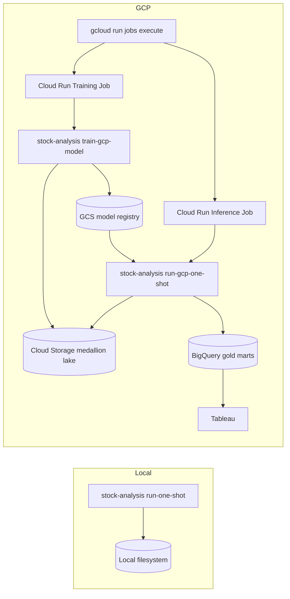

# GCP Direct Cloud Storage Pipeline Plan

Date: 2026-05-02

## Goal

Add a second, cloud-native preprocessing and recommendation pipeline for GCP.

The existing local pipeline must remain available and operational. The new cloud pipeline must write
medallion artifacts directly to Cloud Storage as they are produced. It must not create a complete
local run folder and upload it afterward.

## Decision

Build two explicit pipeline entrypoints:

```text
Local pipeline
  stock-analysis run-one-shot
  -> local filesystem medallion artifacts under data/runs/<run_id>/

Cloud pipeline
  stock-analysis train-gcp-model
  -> direct Cloud Storage medallion artifacts under gs://<bucket>/runs/<training_run_id>/
  -> versioned model artifacts under gs://<bucket>/models/runs/<training_run_id>/
  -> promoted model artifact under gs://<bucket>/models/production/

  stock-analysis run-gcp-one-shot
  -> direct Cloud Storage medallion artifacts under gs://<bucket>/runs/<run_id>/
  -> loads the promoted or explicitly configured GCS model artifact
  -> BigQuery dashboard/history tables for Tableau
```

The two pipelines should share business logic where practical, but they should have separate runtime
entrypoints and separate artifact-store implementations.

## Non-Goals

- Do not replace the local pipeline.
- Do not schedule the job yet.
- Do not introduce Cloud Composer or Dataflow in v1.
- Do not require Tableau Hyper as the cloud serving layer.
- Do not use a local staging directory as the cloud artifact source of truth.
- Do not use Supabase in the GCP runtime.
- Do not use Vertex AI for model training, registry, or inference in this phase.
- Do not retrain inside the GCP inference/recommendation job.

## Target Architecture



The local and cloud pipelines should use the same domain transformations:

- Universe parsing.
- Price ingestion.
- Bronze validation.
- Silver return and feature construction.
- Label generation.
- Forecasting and calibration.
- Optimization.
- Recommendation construction.
- Forecast outcome attachment.
- Account tracking marts.

The difference is the artifact sink:

```text
LocalArtifactStore -> pathlib.Path files
GcsArtifactStore   -> gs:// objects
```

The GCP path also separates model lifecycle from recommendation execution:

```text
train-gcp-model
  -> preprocesses data
  -> trains and calibrates the configured ML forecast model
  -> writes model.cloudpickle, metadata.json, and calibration artifacts to GCS
  -> optionally promotes the model to gs://<bucket>/models/production/model.cloudpickle

run-gcp-one-shot
  -> preprocesses current data
  -> loads the promoted or configured GCS model artifact
  -> scores current candidates, optimizes, writes Tableau marts, and publishes BigQuery
```

## Proposed Stack

| Need | GCP Service / Library |
| --- | --- |
| On-demand execution | Cloud Run Jobs |
| Container registry | Artifact Registry |
| Medallion artifact lake | Cloud Storage |
| Tableau serving layer | BigQuery |
| Runtime identity | Cloud Run service account |
| Logs | Cloud Logging |
| Python GCS writes | `google-cloud-storage` |
| Python BigQuery writes | `google-cloud-bigquery` |

Recommended Python dependency group:

```toml
[project.optional-dependencies]
gcp = [
  "google-cloud-bigquery>=3.0.0",
  "google-cloud-storage>=2.0.0",
]
```

The exact versions can be pinned during implementation based on the lockfile.

## Cloud Medallion Layout

Use a run-scoped medallion layout that mirrors the local structure.

```text
gs://stock-analysis-medallion-prod/runs/<run_id>/
  raw/
    sp500_constituents/
      source.html
      metadata.json
    prices/
      metadata.json
      <provider-payloads>
  bronze/
    sp500_constituents.parquet
    daily_prices.parquet
    csv/
      sp500_constituents.csv
      daily_prices.csv
  silver/
    spy_daily.parquet
    benchmark_returns.parquet
    asset_daily_returns.parquet
    asset_universe_snapshot.parquet
    asset_daily_features_panel.parquet
    asset_daily_features.parquet
    csv/
      ...
  gold/
    labels_panel.parquet
    optimizer_input.parquet
    covariance_matrix.parquet
    forecast_calibration_diagnostics.parquet
    forecast_calibration_predictions.parquet
    portfolio_recommendations.parquet
    portfolio_risk_metrics.parquet
    sector_exposure.parquet
    run_metadata.parquet
    account/history tables when enabled
    csv/
      ...
```

Important rule:

```text
Cloud pipeline writes these objects directly to Cloud Storage.
No completed local data/runs/<run_id> folder is created first.
```

Small temporary buffers in memory are acceptable. A local run folder used as an intermediate artifact
store is not.

## BigQuery Layout

Cloud Storage is the reproducible lake. BigQuery is the Tableau serving layer.

Datasets:

```text
stock_analysis_gold
stock_analysis_metadata
```

Initial BigQuery tables:

| Table | Write Pattern | Dashboard Use |
| --- | --- | --- |
| `stock_analysis_gold.portfolio_recommendations` | Idempotent append by `run_id` | Current and historical actions |
| `stock_analysis_gold.portfolio_risk_metrics` | Idempotent append by `run_id` | Risk cards |
| `stock_analysis_gold.sector_exposure` | Idempotent append by `run_id` | Allocation views |
| `stock_analysis_gold.run_metadata` | Idempotent append by `run_id` | Data freshness and model status |
| `stock_analysis_gold.forecast_calibration_diagnostics` | Idempotent append by `run_id` | Calibration health |
| `stock_analysis_gold.recommendation_runs_history` | Full refresh from account history | Run history |
| `stock_analysis_gold.recommendation_lines_history` | Full refresh from account history | Forecast/outcome history |
| `stock_analysis_gold.performance_snapshots_history` | Full refresh from account history | Account vs SPY |
| `stock_analysis_gold.tableau_dashboard_mart` | Idempotent append or current-view table | Main Tableau dashboard |

Recommended idempotency:

1. Load each DataFrame to a temporary staging table.
2. Delete or merge rows in the target table for the same `run_id` or natural key.
3. Insert from staging into target.
4. Drop staging.

For v1, use delete-by-`run_id` plus append for run-scoped tables. Use full-refresh writes for
account history tables so repeated on-demand runs do not duplicate older history rows.

Recommended partitioning and clustering:

| Table Type | Partition | Cluster |
| --- | --- | --- |
| Run-scoped recommendation tables | `as_of_date` or `run_data_as_of_date` | `run_id`, `ticker` |
| History recommendation tables | `run_data_as_of_date` | `account_slug`, `ticker`, `run_id` |
| Performance history | `as_of_date` | `account_slug` |
| Metadata | `data_as_of_date` | `run_id` |

## Implementation Strategy

### Core Principle

Do not fork the business logic into two unrelated implementations.

Instead:

```text
shared pipeline logic
  -> artifact store interface
    -> local store
    -> GCS store
```

This keeps behavior consistent while preserving separate local and cloud entrypoints.

## Phase 1: Add GCP Config

Add typed config objects in `src/stock_analysis/config.py`.

Proposed YAML:

```yaml
gcp:
  enabled: true
  project_id: stock-analysis-prod
  region: us-central1
  bucket: stock-analysis-medallion-prod
  gcs_prefix: runs
  model_registry_prefix: models
  model_artifact_uri: null
  bigquery_location: US
  bigquery_dataset_gold: stock_analysis_gold
  bigquery_dataset_metadata: stock_analysis_metadata
  publish_bigquery: true
```

Add a new config file:

```text
configs/portfolio.gcp.yaml
```

This file should inherit the same modeling and optimizer settings as `configs/portfolio.yaml`, but:

- Enable the `gcp` section.
- Leave Supabase disabled in the cloud config.
- Use BigQuery as the cloud persistence target for dashboard tables and, after the account
  repository is implemented, cashflows/snapshots.
- Keep local `run.output_root` irrelevant to the cloud command.

Acceptance criteria:

- Existing `configs/portfolio.yaml` still validates.
- New `configs/portfolio.gcp.yaml` validates.
- Local `run-one-shot` does not require GCP dependencies.

## Phase 2: Introduce Artifact Store Interface

Create:

```text
src/stock_analysis/artifacts/store.py
```

Proposed interface:

```python
class RunArtifactStore(Protocol):
    run_id: str

    def uri(self, layer: str, name: str, suffix: str = "parquet") -> str: ...
    def raw_uri(self, source: str, filename: str) -> str: ...
    def csv_uri(self, layer: str, name: str) -> str: ...

    def write_text(self, uri: str, value: str) -> str: ...
    def write_json(self, uri: str, payload: Mapping[str, object]) -> str: ...
    def write_parquet(self, uri: str, frame: pd.DataFrame) -> str: ...
    def write_csv(self, uri: str, frame: pd.DataFrame) -> str: ...
    def write_bytes(self, uri: str, payload: bytes) -> str: ...
    def exists(self, uri: str) -> bool: ...
    def read_parquet(self, uri: str) -> pd.DataFrame: ...
```

Create implementations:

```text
src/stock_analysis/artifacts/local_store.py
src/stock_analysis/gcp/gcs_store.py
```

Local store behavior:

- Uses `pathlib.Path`.
- Preserves current `data/runs/<run_id>/...` behavior.
- Can wrap or replace `ProjectPaths` internally without changing CLI behavior.

GCS store behavior:

- Uses `gs://<bucket>/<prefix>/<run_id>/...`.
- Writes directly to Cloud Storage.
- Does not create a local medallion root.
- Uses `gcsfs` for pandas-compatible direct Parquet/CSV writes, or the GCS client with in-memory
  buffers where more control is needed.

Acceptance criteria:

- Unit tests cover URI construction for local and GCS stores.
- Unit tests verify no GCS URI points to a local temp run folder.
- Existing local path layout remains byte-for-byte compatible at the path level.

## Phase 3: Refactor Shared Writers

Current writer helpers assume local paths:

- `stock_analysis.io.parquet.write_parquet`
- `stock_analysis.io.csv.write_csv`
- `stock_analysis.ingestion.raw_store.write_text`
- `stock_analysis.ingestion.raw_store.write_json`
- `ProjectPaths`

Refactor carefully:

```text
Before:
  write_parquet(df, paths.gold_path("portfolio_recommendations"))

After:
  store.write_parquet(store.uri("gold", "portfolio_recommendations"), df)
```

Do this in a compatibility-preserving way:

1. Keep existing local writer functions for local call sites during the transition.
2. Add store-based writer functions.
3. Move `run_one_shot` internals to a shared implementation that accepts a store.

Suggested shape:

```text
src/stock_analysis/pipeline/one_shot.py
  run_one_shot(config) -> local pipeline
  _run_one_shot_with_store(config, store, mode="local") -> shared logic

src/stock_analysis/pipeline/gcp_one_shot.py
  run_gcp_one_shot(config) -> cloud pipeline
```

Acceptance criteria:

- `run_one_shot` still returns local filesystem paths.
- `run_gcp_one_shot` returns GCS URIs and BigQuery table ids.
- Existing tests for local output paths still pass.

## Phase 4: Add Cloud Pipeline Entrypoint

Create:

```text
src/stock_analysis/pipeline/gcp_one_shot.py
```

Responsibilities:

1. Validate `gcp.enabled = true`.
2. Resolve `run_id`.
3. Create `GcsArtifactStore`.
4. Call the shared one-shot logic using that store.
5. Build or reuse Tableau/dashboard marts.
6. Publish selected gold/history tables to BigQuery when `gcp.publish_bigquery = true`.
7. Return GCS URIs and BigQuery table ids.

The cloud pipeline should not call the local `ProjectPaths` output root except for compatibility
objects that do not touch disk.

Acceptance criteria:

- Cloud command can run locally using Application Default Credentials and write to a test GCS bucket.
- Cloud command can run in Cloud Run Job using service account credentials.
- No local medallion run folder is created by the cloud command.

## Phase 5: Add BigQuery Publisher

Create:

```text
src/stock_analysis/gcp/bigquery.py
```

Proposed functions:

```python
publish_gold_tables_to_bigquery(
    tables: Mapping[str, pd.DataFrame],
    config: GcpConfig,
    run_id: str,
) -> dict[str, str]
```

Start with DataFrame loads. Do not require BigQuery to read directly from GCS for v1.

Reason:

- DataFrames already exist in memory during the pipeline.
- Loading DataFrames to BigQuery avoids schema drift from external table inference.
- GCS still remains the durable medallion artifact store.

Publish table groups:

```text
current_run_tables:
  portfolio_recommendations
  portfolio_risk_metrics
  sector_exposure
  run_metadata
  forecast_calibration_diagnostics
  forecast_calibration_predictions
  tableau_dashboard_mart

history_tables:
  cashflows_history
  portfolio_snapshots_history
  holding_snapshots_history
  recommendation_runs_history
  recommendation_lines_history
  performance_snapshots_history
```

Acceptance criteria:

- BigQuery load job errors fail the cloud pipeline.
- Table ids are returned in the pipeline result.
- Tables include `run_id` where applicable.
- Idempotent rerun of the same `run_id` does not duplicate run-scoped rows.

## Phase 6: Add CLI Commands

Add two GCP commands in `src/stock_analysis/cli.py`:

```bash
uv run --extra gcp stock-analysis train-gcp-model \
  --config configs/portfolio.gcp.yaml \
  --forecast-engine ml

uv run --extra gcp stock-analysis run-gcp-one-shot \
  --config configs/portfolio.gcp.yaml \
  --forecast-engine ml
```

Do not change:

```bash
uv run stock-analysis run-one-shot \
  --config configs/portfolio.yaml \
  --forecast-engine ml
```

CLI output should include:

```text
Completed GCP model training <run_id>
GCS run root: gs://<bucket>/runs/<training_run_id>/
Model artifact: gs://<bucket>/models/runs/<training_run_id>/model.cloudpickle
Production model: gs://<bucket>/models/production/model.cloudpickle

Completed GCP run <run_id>
GCS run root: gs://<bucket>/runs/<run_id>/
Model artifact: gs://<bucket>/models/production/model.cloudpickle
BigQuery tables:
  stock_analysis_gold.portfolio_recommendations
  stock_analysis_gold.tableau_dashboard_mart
```

Acceptance criteria:

- `stock-analysis --help` shows both local and GCP commands.
- `run-one-shot` does not import GCP-only dependencies at module import time unless the cloud command
  is executed.

## Phase 7: Containerize Cloud Pipeline

Add:

```text
Dockerfile
.dockerignore
deployment/gcp/cloud-run-job.md
```

Container commands:

```bash
stock-analysis train-gcp-model \
  --config configs/portfolio.gcp.yaml \
  --forecast-engine ml

stock-analysis run-gcp-one-shot \
  --config configs/portfolio.gcp.yaml \
  --forecast-engine ml
```

The container should install the GCP extra:

```bash
uv sync --extra gcp --extra mlflow
```

The cloud image should not install the Supabase extra. MLflow can be included only if needed in the
cloud job.

Acceptance criteria:

- Docker image builds locally.
- Container can run `stock-analysis --help`.
- Container can execute the GCP command with credentials in a GCP runtime.

## Phase 8: Create GCP Resources

Manual, on-demand v1 resources:

```text
Artifact Registry repository
Cloud Storage bucket
BigQuery datasets
Cloud Run training job
Cloud Run inference job
Service account
```

Minimum service account roles:

```text
roles/storage.objectAdmin on the medallion bucket
roles/bigquery.dataEditor on target datasets
roles/bigquery.jobUser on the project
roles/logging.logWriter
```

No Cloud Scheduler yet.

Cloud Run Job execution:

```bash
gcloud run jobs execute stock-analysis-train-model \
  --region us-central1 \
  --wait

gcloud run jobs execute stock-analysis-one-shot \
  --region us-central1 \
  --wait
```

Acceptance criteria:

- Training and inference jobs run on demand.
- Cloud Logging shows run id, GCS run root, and model artifact URI when applicable.
- GCS contains raw, bronze, silver, gold, and model artifacts.
- BigQuery contains dashboard tables.

## Phase 9: Add Tests

Unit tests:

- `GcsArtifactStore` URI construction.
- `LocalArtifactStore` path compatibility.
- Store-based Parquet/CSV writer contract using fakes.
- Cloud config validation.
- CLI command registration.
- BigQuery publisher table naming and write-disposition choices.
- Idempotency SQL or delete/merge query generation.

Integration tests with fake clients:

- Run shared pipeline logic against a fake artifact store.
- Assert expected medallion artifacts are written.
- Assert BigQuery publisher receives the expected DataFrames.

Optional live integration tests:

- GCS write/read test gated by `STOCK_ANALYSIS_TEST_GCP=1`.
- BigQuery load test gated by `STOCK_ANALYSIS_TEST_GCP=1`.

Acceptance criteria:

- Existing local test suite still passes.
- GCP tests are isolated and do not require credentials by default.

## Phase 10: Add Runbook

Add:

```text
runbooks/gcp-on-demand-cloud-run.md
```

Must include:

1. Required local tools.
2. GCP project setup.
3. Artifact Registry creation.
4. Cloud Storage bucket creation.
5. BigQuery dataset creation.
6. Service account and IAM roles.
7. Docker build and push.
8. Cloud Run Job creation.
9. Manual job execution.
10. Tableau connection to BigQuery.
11. Troubleshooting.

Include exact command templates:

```bash
gcloud config set project <project_id>
gcloud artifacts repositories create stock-analysis --repository-format=docker --location=us-central1
gcloud storage buckets create gs://<bucket> --location=us-central1
bq --location=US mk --dataset <project_id>:stock_analysis_gold
gcloud run jobs create stock-analysis-train-model ...
gcloud run jobs create stock-analysis-one-shot ...
gcloud run jobs execute stock-analysis-train-model --region us-central1 --wait
gcloud run jobs execute stock-analysis-one-shot --region us-central1 --wait
```

## Implementation Order

1. Add GCP config model and `configs/portfolio.gcp.yaml`.
2. Add artifact store interface.
3. Add local artifact store and adapt local pipeline through the shared store without changing CLI
   behavior.
4. Add GCS artifact store.
5. Add GCS model registry.
6. Add cloud model training wrapper.
7. Add cloud one-shot wrapper that loads a GCS model artifact instead of retraining.
8. Add BigQuery publisher.
9. Add `train-gcp-model` and `run-gcp-one-shot` CLI commands.
10. Add tests around store, config, model registry, publisher, and CLI.
11. Add Dockerfile and Cloud Run Job docs.
12. Manually execute training and inference against a dev bucket/dataset.

## Acceptance Criteria

The feature is complete when:

1. `run-one-shot` still writes local artifacts under `data/runs/<run_id>/`.
2. `train-gcp-model` writes raw, bronze, silver, gold, and model artifacts directly to GCS.
3. `run-gcp-one-shot` writes raw, bronze, silver, and gold artifacts directly to GCS.
4. `run-gcp-one-shot` loads the promoted or explicitly configured GCS model artifact and does not
   retrain.
5. `run-gcp-one-shot` fails clearly when no GCS model artifact exists.
6. GCS run layout mirrors the local medallion layout.
7. BigQuery receives Tableau-ready gold/history tables.
8. Tableau can connect to BigQuery for the dashboard.
9. Cloud Run Jobs can be executed on demand.
10. GCP credentials are handled through the Cloud Run service account, not committed files.
11. Tests prove local behavior remains intact.
12. Runbook provides exact deployment and execution commands.

## Key Risks

| Risk | Mitigation |
| --- | --- |
| GCP dependencies leak into local-only usage | Lazy-import GCP libraries only inside GCP modules |
| Refactor breaks local pipeline | Add compatibility tests before moving write call sites |
| Pandas GCS writes have auth or filesystem issues | Hide behind `GcsArtifactStore` and add live gated tests |
| BigQuery schema drift breaks Tableau | Use explicit table schemas or stable DataFrame columns before load |
| Cloud run fails after partial writes | Keep run-scoped immutable GCS paths and BigQuery idempotency by `run_id` |
| Same run id is retried | Overwrite same GCS object names and replace/merge same BigQuery `run_id` rows |
| Large DataFrames exceed memory | Revisit chunked Parquet writes or BigQuery load from GCS after v1 |
| Inference accidentally retrains | Require an existing GCS model artifact in the GCP inference wrapper |
| Model/config mismatch | Validate the loaded artifact model version against the inference config |

## Open Design Choices

These should be resolved during implementation:

1. Use `gcsfs` for all `gs://` pandas writes, or use the Google Cloud Storage client with in-memory
   buffers for stricter control.
2. Keep CSV mirrors in GCS for Tableau Prep parity, or limit cloud CSV mirrors to dashboard-critical
   tables only.
3. Publish BigQuery managed tables from in-memory DataFrames, or load from the Parquet objects just
   written to GCS.
4. Use `WRITE_TRUNCATE` on a current-view table plus append history, or use only append/merge tables
   with Tableau filters.

Recommended v1 choices:

- Use the Google Cloud Storage client with in-memory buffers for direct GCS Parquet/CSV writes.
- Keep CSV mirrors in GCS to preserve medallion parity.
- Publish BigQuery from in-memory DataFrames.
- Use idempotent append/replace by `run_id` for run-scoped tables.

## Final Shape

After implementation, operators should have two independent commands:

```bash
# Local
uv run stock-analysis run-one-shot \
  --config configs/portfolio.yaml \
  --forecast-engine ml

# Cloud training, direct GCS artifacts and model registry
uv run --extra gcp stock-analysis train-gcp-model \
  --config configs/portfolio.gcp.yaml \
  --forecast-engine ml

# Cloud inference, direct GCS artifacts
uv run --extra gcp stock-analysis run-gcp-one-shot \
  --config configs/portfolio.gcp.yaml \
  --forecast-engine ml
```

And two on-demand Cloud Run commands:

```bash
gcloud run jobs execute stock-analysis-train-model \
  --region us-central1 \
  --wait

gcloud run jobs execute stock-analysis-one-shot \
  --region us-central1 \
  --wait
```

The local pipeline remains the developer workflow. The GCP pipeline becomes the cloud production path
for direct Cloud Storage medallion artifacts and BigQuery-backed Tableau dashboards.
