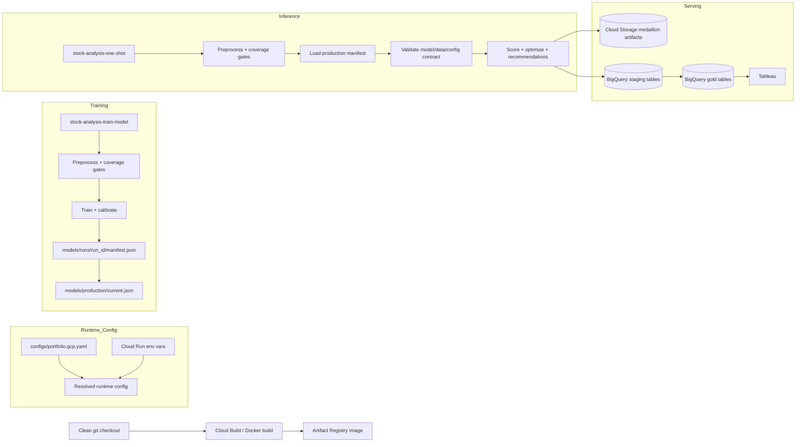

# GCP Deployment And Preprocessing Remediation Plan

Date: 2026-05-03

## Goal

Fix the deployment and preprocessing risks found in the GCP review without changing the local
pipeline contract.

This plan covers:

- `stock-analysis-799`: make Cloud Run deployment config reproducible.
- `stock-analysis-afa`: validate model artifact data-date and horizon contract before inference.
- `stock-analysis-bgp`: add per-ticker price freshness and coverage gates.
- `stock-analysis-dk4`: make GCS model promotion bundle atomic.
- `stock-analysis-ob6`: make BigQuery run-scoped publishes atomic.
- `stock-analysis-bdg`: replace GCP account/history persistence with BigQuery.

## Target State

Cloud Run jobs should be rebuildable from a clean git checkout. No job should depend on an
untracked config file that happened to be present in a previous Docker build context.

GCP inference should only score from a complete, promoted model bundle whose metadata is compatible
with the current feature panel and forecast configuration.

Preprocessing should make data freshness observable and enforceable. The pipeline should know which
requested tickers were returned, which are stale, and which were dropped before training or
inference.

BigQuery publishes should not delete the previous version of a run before the replacement has been
loaded successfully.

## Proposed Architecture



## Phase 1: Reproducible Cloud Run Config

Issue: `stock-analysis-799`

### Problem

The live `proyectodata` jobs use:

```text
--config configs/portfolio.gcp.proyectodata.yaml
```

That file is not tracked. A clean rebuild from git will omit it, so the deployed jobs are not
reproducible.

### Implementation

1. Keep only safe, generic config in git:

   ```text
   configs/portfolio.gcp.yaml
   ```

2. Add runtime config overrides for Cloud Run environment variables.

   Recommended env vars:

   ```text
   STOCK_ANALYSIS_GCP_PROJECT_ID
   STOCK_ANALYSIS_GCP_REGION
   STOCK_ANALYSIS_GCP_BUCKET
   STOCK_ANALYSIS_GCP_GCS_PREFIX
   STOCK_ANALYSIS_GCP_BIGQUERY_DATASET_GOLD
   STOCK_ANALYSIS_GCP_MODEL_REGISTRY_PREFIX
   STOCK_ANALYSIS_GCP_MODEL_ARTIFACT_URI
   STOCK_ANALYSIS_RUN_AS_OF_DATE
   STOCK_ANALYSIS_RUN_ID
   ```

3. Add a small config function:

   ```text
   load_config(path)
     -> PortfolioConfig
     -> apply_env_overrides(config, os.environ)
   ```

   Keep local behavior unchanged when env vars are absent.

4. Update Cloud Run jobs to use:

   ```text
   --config configs/portfolio.gcp.yaml
   ```

   and set project-specific values through env vars.

5. Harden `.dockerignore` so project-local config files cannot be accidentally baked into images:

   ```text
   configs/*.local.yaml
   configs/*.proyectodata.yaml
   configs/*.secret.yaml
   ```

6. Update the runbook with `gcloud run jobs create/update --set-env-vars`.

7. Prefer deploying images by digest after build:

   ```bash
   gcloud artifacts docker images describe \
     "${REGION}-docker.pkg.dev/${PROJECT_ID}/${REPOSITORY}/${IMAGE}:${TAG}" \
     --format="value(image_summary.digest)"
   ```

   Then set the job image to `image@sha256:...` or record the digest in the runbook.

### Acceptance Criteria

- A clean git checkout can build the image and run both Cloud Run jobs.
- `configs/portfolio.gcp.proyectodata.yaml` is not required and is not copied into the image.
- Cloud Run job args use `configs/portfolio.gcp.yaml`.
- Project-specific values come from Cloud Run env vars.
- Tests cover env override parsing and precedence.

## Phase 2: Preprocessing Freshness And Coverage Gates

Issue: `stock-analysis-bgp`

### Problem

The pipeline uses the max date in the whole price table as `data_as_of_date`. Tickers missing that
date silently disappear from the latest feature panel. This hides stale/missing data from both model
training and inference.

### Implementation

1. Add a price coverage table during preprocessing:

   ```text
   gold/price_coverage.parquet
   gold/csv/price_coverage.csv
   ```

   Suggested columns:

   ```text
   requested_ticker
   requested_provider_ticker
   ticker
   returned_rows
   first_price_date
   last_price_date
   latest_global_price_date
   stale_calendar_days
   has_latest_price_date
   has_latest_feature_row
   included_in_training_or_inference
   is_benchmark_candidate
   coverage_status
   coverage_reason
   ```

2. Add config thresholds:

   ```yaml
   prices:
     max_stale_calendar_days: 5
     min_requested_ticker_coverage: 0.95
     fail_on_missing_benchmark: true
     fail_on_low_coverage: true
   ```

3. Enforce hard failures for:

   - Benchmark ticker missing or stale.
   - Overall requested ticker coverage below threshold.
   - Latest feature panel empty after coverage filtering.

4. Keep stale non-benchmark tickers droppable, but record them explicitly in `price_coverage`.

5. Add coverage fields to `run_metadata`:

   ```text
   requested_ticker_count
   returned_ticker_count
   latest_price_ticker_count
   stale_ticker_count
   missing_ticker_count
   price_coverage_ratio
   benchmark_price_status
   ```

6. Publish `price_coverage` to BigQuery so Tableau can show data quality.

### Acceptance Criteria

- Fixtures with missing/stale tickers produce explicit `price_coverage` rows.
- Missing/stale SPY fails the run when `fail_on_missing_benchmark=true`.
- Low coverage fails when below threshold.
- Current valid fixture still passes.
- BigQuery includes `price_coverage`.

## Phase 3: Model Artifact Contract Validation

Issue: `stock-analysis-afa`

### Problem

GCP inference validates only `model_version`. It should also validate the artifact against the
current feature data date and forecast contract.

### Implementation

1. Refactor the one-shot flow so GCP inference can preprocess before model loading.

   Recommended shape:

   ```text
   prepare_one_shot_medallion_data(...)
   load_model_artifact(...)
   validate_model_contract(artifact, medallion, config)
   run_one_shot_from_medallion_data(...)
   ```

   This avoids running preprocessing twice and gives validation access to `data_as_of_date`.

2. Add contract validation:

   ```text
   artifact.model_version == config.forecast.ml_model_version
   artifact.trained_through_date <= medallion.data_as_of_date
   artifact.horizon_days == expected_horizon_days(config)
   artifact.target_column == expected_target_column(config)
   artifact.feature_columns subset of feature_panel columns
   artifact.expected_return_is_calibrated is compatible with config.ml_use_calibrated_expected_return
   artifact.calibration_target == config.ml_calibration_target
   artifact.calibration_method == config.ml_calibration_method
   ```

3. Add an escape hatch only if needed:

   ```yaml
   gcp:
     allow_model_trained_after_data: false
   ```

   Default must be `false`.

4. Write contract check output to metadata:

   ```text
   model_contract_status
   model_contract_checked_at_utc
   model_contract_failure_reason
   ```

### Acceptance Criteria

- Inference fails if model trained-through date is after inference `data_as_of_date`.
- Inference fails if horizon/target/model version mismatches.
- Inference fails if calibrated expected return is required but artifact is uncalibrated.
- Integration test proves GCP inference loads a compatible artifact and rejects incompatible ones.

## Phase 4: Atomic GCS Model Promotion

Issue: `stock-analysis-dk4`

### Problem

Production promotion overwrites `model.cloudpickle`, `metadata.json`, and calibration files
independently. Inference checks only `model.cloudpickle`, so partial promotion can produce mixed
or stale bundles.

### Implementation

1. Treat run model bundles as immutable:

   ```text
   gs://<bucket>/models/runs/<run_id>/
     model.cloudpickle
     metadata.json
     calibration_diagnostics.parquet
     calibration_predictions.parquet
     manifest.json
   ```

2. Write `manifest.json` last in the versioned run bundle.

   Manifest fields:

   ```text
   run_id
   model_uri
   metadata_uri
   calibration_diagnostics_uri
   calibration_predictions_uri
   model_version
   target_column
   horizon_days
   trained_through_date
   expected_return_is_calibrated
   config_hash
   object_generations
   created_at_utc
   ```

3. Promote by writing a pointer object last:

   ```text
   gs://<bucket>/models/production/current.json
   ```

   The pointer should contain:

   ```text
   manifest_uri
   source_run_id
   promoted_at_utc
   config_hash
   promoted_by
   ```

4. Inference should load `current.json`, then load and validate `manifest.json`, then load the
   model object referenced by the manifest.

5. Use GCS generation preconditions where practical:

   - Avoid overwriting immutable run bundle files.
   - Make production pointer update explicit.

6. Keep old direct `model_artifact_uri` support temporarily, but prefer manifest/pointer URIs.

### Acceptance Criteria

- Inference fails if `current.json` is missing.
- Inference fails if manifest is missing or incomplete.
- Inference no longer treats bare `model.cloudpickle` as sufficient production state.
- Unit tests simulate partial bundle writes and confirm inference rejects them.

## Phase 5: Atomic BigQuery Publish

Issue: `stock-analysis-ob6`

### Problem

For run-scoped tables, the publisher deletes existing rows for a `run_id` and then loads
replacement rows. If the load fails after delete, Tableau loses that run.

### Implementation

1. Load each DataFrame to a staging table first:

   ```text
   stock_analysis_gold._staging_<table>_<run_id_hash>
   ```

2. Replace delete+append with a BigQuery script:

   ```sql
   BEGIN TRANSACTION;
   DELETE FROM target WHERE run_id = @run_id;
   INSERT INTO target SELECT * FROM staging;
   COMMIT TRANSACTION;
   ```

   If the insert fails, rollback preserves existing rows.

3. Drop staging table after success. Leave it for debugging on failure or add a cleanup command.

4. For full-refresh history tables, use either:

   ```sql
   CREATE OR REPLACE TABLE target AS SELECT * FROM staging;
   ```

   or merge by natural key once BigQuery account tracking exists.

5. Add explicit BigQuery schemas or dtype normalization at the same time. This also advances
   `stock-analysis-dqk`.

### Acceptance Criteria

- Unit test proves existing target rows remain if staging load or insert fails.
- Publisher returns table IDs only after the atomic publish succeeds.
- Live GCP run publishes without pandas all-null schema warnings for core tables.

## Phase 6: BigQuery Account Tracking And Accurate Runbook History

Issue: `stock-analysis-bdg`

### Problem

The runbook lists recommendation/performance history tables, but cloud history tables are not
available until the GCP path has a BigQuery-backed account tracking repository.

### Implementation

1. Update the runbook immediately to separate:

   - Current-run tables available now.
   - Account/history tables available after `stock-analysis-bdg`.

2. Implement `BigQueryAccountTrackingRepository` with:

   ```text
   accounts
   cashflows
   portfolio_snapshots
   holding_snapshots
   recommendation_runs
   recommendation_lines
   performance_snapshots
   ```

3. Add idempotent upserts and natural keys.

4. Wire GCP config:

   ```yaml
   live_account:
     enabled: true
     cashflow_source: actual

   gcp:
     account_tracking_backend: bigquery
   ```

5. Publish history marts from BigQuery-backed repository.

### Acceptance Criteria

- Runbook no longer implies history tables exist before BigQuery account tracking is enabled.
- GCP can register/read cashflows and snapshots without Supabase.
- Tableau can plot recommendation and performance history from BigQuery.

## Implementation Order

1. Fix deployment reproducibility (`stock-analysis-799`).
2. Add preprocessing coverage table and freshness gates (`stock-analysis-bgp`).
3. Refactor GCP inference to validate model contract after preprocessing (`stock-analysis-afa`).
4. Introduce manifest/pointer based GCS model promotion (`stock-analysis-dk4`).
5. Make BigQuery publish atomic and schema-stable (`stock-analysis-ob6`, part of
   `stock-analysis-dqk`).
6. Update runbook history claims.
7. Implement BigQuery account tracking (`stock-analysis-bdg`).

This order matters because deployment reproducibility should be fixed before further live testing,
and model contract validation needs preprocessing data dates.

## Validation Plan

### Local Gates

```bash
uv run ruff check src tests
uv run ruff format --check src tests
uv run mypy src/stock_analysis
uv run pytest
```

### Targeted Tests

- Config env override tests.
- `.dockerignore` or build-context test that `configs/*.proyectodata.yaml` is excluded.
- Price coverage tests for missing, stale, and valid tickers.
- Model contract tests for future-trained, wrong horizon, wrong target, and uncalibrated artifact.
- GCS manifest tests for partial promotion.
- BigQuery publisher failure tests proving old rows remain.

### Live GCP Smoke

Use `proyectodata-348005`:

```bash
gcloud builds submit \
  --region=us-central1 \
  --project=proyectodata-348005 \
  --tag=us-central1-docker.pkg.dev/proyectodata-348005/stock-analysis/stock-analysis:<tag> \
  --timeout=1800s .

gcloud run jobs update stock-analysis-train-model \
  --project=proyectodata-348005 \
  --region=us-central1 \
  --image=<image-or-digest> \
  --args=train-gcp-model,--config,configs/portfolio.gcp.yaml,--forecast-engine,ml \
  --set-env-vars=STOCK_ANALYSIS_GCP_PROJECT_ID=proyectodata-348005,STOCK_ANALYSIS_GCP_BUCKET=proyectodata-stock-analysis-medallion

gcloud run jobs update stock-analysis-one-shot \
  --project=proyectodata-348005 \
  --region=us-central1 \
  --image=<image-or-digest> \
  --args=run-gcp-one-shot,--config,configs/portfolio.gcp.yaml,--forecast-engine,ml \
  --set-env-vars=STOCK_ANALYSIS_GCP_PROJECT_ID=proyectodata-348005,STOCK_ANALYSIS_GCP_BUCKET=proyectodata-stock-analysis-medallion

gcloud run jobs execute stock-analysis-train-model \
  --project=proyectodata-348005 \
  --region=us-central1 \
  --wait

gcloud run jobs execute stock-analysis-one-shot \
  --project=proyectodata-348005 \
  --region=us-central1 \
  --wait
```

Verify:

```bash
gcloud storage ls gs://proyectodata-stock-analysis-medallion/models/production/
gcloud storage ls gs://proyectodata-stock-analysis-medallion/runs/
bq --project_id=proyectodata-348005 ls stock_analysis_gold
```

Expected live checks:

- Job args use tracked `configs/portfolio.gcp.yaml`.
- Production model is loaded through `current.json` or manifest.
- `run_metadata.model_contract_status = passed`.
- `price_coverage` exists in GCS and BigQuery.
- BigQuery publish succeeds without deleting old rows on simulated failure.

## Definition Of Done

- All linked issues are either closed or explicitly deferred with a reason.
- A clean checkout can rebuild and redeploy the GCP jobs.
- Training and inference succeed in `proyectodata-348005`.
- Tableau current-run tables remain available.
- History-table claims in the runbook match implemented reality.
- No Vertex AI or Supabase dependency is introduced into the GCP runtime.
